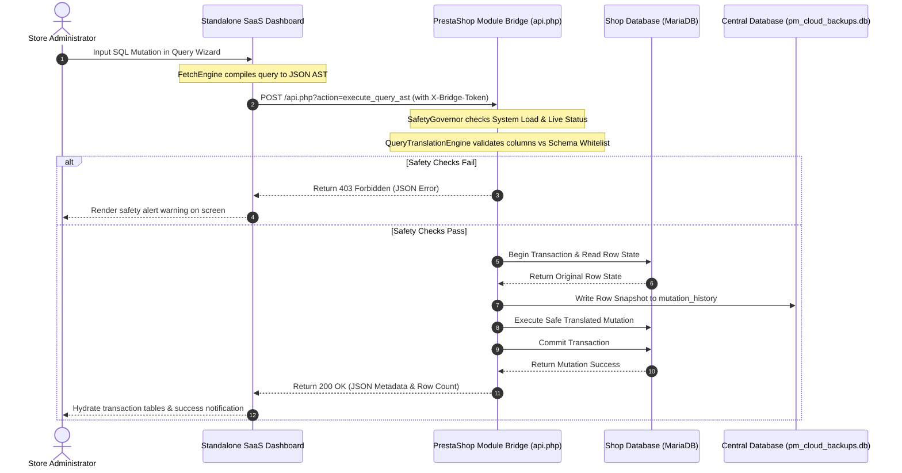

# 🗃️ Mass Utility - Production Engineering Manual

Welcome to the **Mass Utility Framework**, an enterprise-grade, zero-trust decoupled administration suite designed for PrestaShop. 

This framework separates your **Presentation/SaaS Dashboard UI** from your **PrestaShop Active Core** using a secure, transactional HTTP Bridge API. By segregating complex operations (like AST database operations, chunked backups, search index sweeps, and local transaction log rollbacks) from the main database execution stream, Mass Utility preserves database speed while offering maximum operational security.

---

## 📊 1. System Architecture & Data Flows

Mass Utility is structured as a decoupled monorepo containing three key components: the **Native PrestaShop Module** (bridge), the **Standalone SaaS Dashboard** (merchant client), and the **Super-Admin Licensing Portal**.



### Monorepo Components
*   **`mass_utility/` (PrestaShop Module)**: Houses the local Bridge API (`api.php`), the `QueryTranslationEngine` compiler, database backup chunk engines, Google Drive API upload clients, and safety thresholds.
*   **`mass_utility_dashboard/` (Standalone SaaS App)**: A lightweight PHP router (`public/index.php`) and a single-page administration app powered by modern CSS variables and modular ES6 JavaScript controllers.
*   **`mass_utility_admin/` (Super-Admin Licensing Portal)**: A licensing server used to register clients, manage key tiers (`basic`, `pro`, `developer`), and control store domain bindings.

---

## 🔒 2. Security & Authentication Matrix

To guarantee that no external actors can execute arbitrary database edits or access files, the Bridge API enforces a zero-trust verification boundary:

### 2.1 Header Authentication
Every request transmitted to `mass_utility/api.php` must carry the following headers:
- `X-Bridge-Token`: Contains the secure authorization hash. This must match the `PM_SECURE_TOKEN` configuration key stored in the PrestaShop database.
- `X-Bridge-Version`: Tells the Bridge what API schema version is being requested. The gateway strictly validates that this value matches `1.0.0` (as asserted on line 11 in `api.php`).

### 2.2 One-Time Token (SSO / OTT) Redirect Flow
When the administrator clicks the **Launch Standalone Dashboard** button inside the PrestaShop Admin Panel, the module generates a secure redirect URL:
1.  The module compiles a temporary token stored in the database with a **60-second Time-To-Live (TTL)**.
2.  The admin is redirected to `https://dashboard-url.com/?ott=<token>`.
3.  The SaaS Router decrypts the OTT using the shared `PM_BRIDGE_TOKEN` from SQLite. If valid, it hydrates a PHP session and immediately redirects to the clean root URL, stripping the OTT parameter from browser memory to prevent replay hijacking.

### 2.3 Domain Whitelisting & Key Activation
*   License keys are generated globally inside the Super-Admin panel.
*   Upon activation in PrestaShop, the licensing server binds the license key to the client store's domain (`HTTP_HOST`).
*   Any future verification requests from another domain are rejected, neutralizing license key sharing exploits.

---

## 🔌 3. API Gateway Reference

The system routes operations through a two-tier decoupled API structure: Dashboard AJAX endpoints (local browser-to-dashboard communication) and Bridge Gateway actions (dashboard-to-PrestaShop MySQL communication).

### 3.1 Tier 1: Standalone SaaS Dashboard AJAX Actions (`public/index.php`)
These endpoints are sent by the admin browser UI to the Dashboard Backend (`index.php` router).

| Action Key | HTTP Method | Expected Success Response | Description |
| :--- | :--- | :--- | :--- |
| `get_auth_status` | `POST` | `{"success":true,"licensed":true,"gdrive":true}` | Asserts handshake status and checks active Google Drive states. |
| `clear_saas_log` | `POST` | `{"success":true}` | Clears the local dashboard debug logging queue. |

### 3.2 Tier 2: Headless Bridge API Actions (`api.php`)
These endpoints are executed by the Dashboard client to read and write PrestaShop MySQL tables.

| Action Key | HTTP Method | Input Parameters | Success Response (JSON) | Description |
| :--- | :--- | :--- | :--- | :--- |
| `ping` | `GET` | None | `{"status":"alive","client_cpu":0.05}` | Telemetry check returning CPU cores, memory limits, and PHP settings. |
| `get_catalog_stats` | `GET` | None | `{"success":true,"products":42}` | Fast count profiles for active products and categories. |
| `get_categories` | `GET` | `{"id_lang":1}` | `{"success":true,"categories":[]}` | Returns a lookup tree of active categories. |
| `query_products` | `POST` | `{"ast":AST_JSON}` | `{"success":true,"product_ids":[]}` | Translates AST criteria and returns all matching target product IDs. |
| `db_query` | `POST` | `{"sql":"...","method":"executeS"}`| `{"success":true,"result":[]}` | Safe execution gateway for reading schemas. |
| `execute-chunk` | `POST` | `{"queries":[]}` | `{"success":true,"client_cpu":0.1}` | Executes SQL updates wrapped in a single database transaction. |

---

## 💾 4. SQLite Database Schema Reference

All administrative operations, preset query configurations, client licenses, and log states are maintained inside a single unified SQLite database file located at `mass_utility_dashboard/data/pm_cloud_backups.db`.

### Table: `tenant_settings`
Tracks configuration states and active licensing variables:
```sql
CREATE TABLE tenant_settings (
    name VARCHAR(255) PRIMARY KEY,
    value TEXT
);
```

### Table: `mass_update_presets`
Stores reusable AST templates generated by the Query Wizard:
```sql
CREATE TABLE mass_update_presets (
    id_preset INTEGER PRIMARY KEY AUTOINCREMENT,
    name VARCHAR(255) NOT NULL,
    type VARCHAR(50) NOT NULL,
    payload TEXT NOT NULL,
    date_add DATETIME NOT NULL
);
```

### Table: `mass_update_log`
Tracks query actions and rollback snapshots:
```sql
CREATE TABLE mass_update_log (
    id_mass_update_log INTEGER PRIMARY KEY AUTOINCREMENT,
    job_id VARCHAR(64) NOT NULL,
    state VARCHAR(24) NOT NULL,
    affected_count INT DEFAULT 0,
    payload TEXT NOT NULL,
    revert_payload TEXT DEFAULT NULL,
    errors TEXT DEFAULT NULL,
    date_add DATETIME NOT NULL,
    date_upd DATETIME NOT NULL,
    UNIQUE (job_id)
);
```

### Table: `pm_licenses`
Tracks licensed client records and expiration checks on the Super-Admin panel:
```sql
CREATE TABLE pm_licenses (
    id INTEGER PRIMARY KEY AUTOINCREMENT,
    user_id INTEGER NOT NULL,
    license_key VARCHAR(64) UNIQUE NOT NULL,
    store_url VARCHAR(255) NULL,
    package_tier VARCHAR(32) DEFAULT 'basic',
    status VARCHAR(32) DEFAULT 'active',
    expires_at DATETIME NULL,
    created_at DATETIME DEFAULT CURRENT_TIMESTAMP,
    updated_at DATETIME DEFAULT CURRENT_TIMESTAMP,
    FOREIGN KEY(user_id) REFERENCES pm_users(id) ON DELETE CASCADE
);
```
