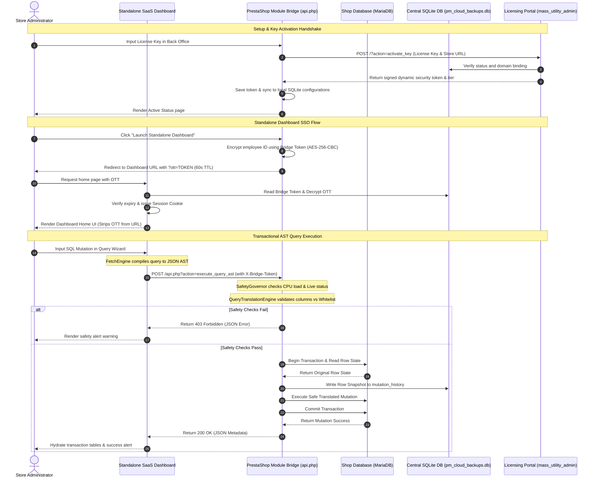

# 🗃️ Mass Utility - Consolidated Technical Manual & Reference Guide

Welcome to the **Mass Utility Framework**, an enterprise-grade, zero-trust decoupled administration suite designed for PrestaShop. 

This framework separates your **Presentation/SaaS Dashboard UI** from your **PrestaShop Active Core** using a secure, transactional HTTP Bridge API. By segregating complex operations (like AST database operations, chunked backups, search index sweeps, and local transaction log rollbacks) from the main database execution stream, Mass Utility preserves database speed while offering maximum operational security.

---

## 📊 1. Comprehensive System Architecture & Interconnectivity

Mass Utility is structured as a decoupled monorepo containing three key components:
1.  **Native PrestaShop Module (`mass_utility/`)**: The transactional bridge executing operations on PrestaShop core tables (MariaDB) and enforcing safety bounds.
2.  **Standalone SaaS Dashboard (`mass_utility_dashboard/`)**: The Single-Page application (SPA) used by merchant operators to write AST queries, manage files, and backup storage.
3.  **Super-Admin Licensing Portal (`mass_utility_admin/`)**: The licensing server used by the system operator to issue license keys, update subscription tiers, and control domain bounds.

### 🔄 End-to-End Handshake & Execution Diagram



---

## 📁 2. Monorepo Repository Structure

Below is the directory tree of the workspace, detailing the responsibility mapping of each subsystem:

```
d:/Project Mass/
├── WORKSPACE.md                    # Agent workflow constitution and directories manifest
├── README.md                       # This comprehensive systems manual
├── .gitignore                      # Workspace ignores (DBs, logs, caches)
├── mass_utility/                   # NATIVE PRESTASHOP MODULE (Transactional Bridge)
│   ├── mass_utility.php            # Module installer, hooks, back-office layout controller
│   ├── api.php                     # Unauthenticated gateway receiver for Dashboard API calls
│   ├── src/
│   │   ├── Compiler/
│   │   │   └── QueryTranslationEngine.php  # AST compiler, query whitelist, rollback compiler
│   │   └── Governor/
│   │       └── SafetyGovernor.php          # Monitors system averages & maintenance thresholds
│   │
├── mass_utility_dashboard/         # MERCHANTS CLIENT PORTAL (Standalone Dashboard)
│   ├── public/
│   │   └── index.php               # Front Router gateway, OTT decryptor, OAuth broker callback
│   ├── src/
│   │   ├── Controller/
│   │   │   └── Api/
│   │   │       └── LicenseVerifyController.php # Dispatches license validation calls
│   │   └── Service/
│   │       ├── SQLiteConnectionManager.php     # Establishes connections to SQLite
│   │       ├── TenantSettingsRepository.php    # Manages settings with plain fallbacks
│   │       └── SaaSGoogleOAuthBroker.php       # Google Drive token broker handler
│   └── views/
│       ├── css/                    # Custom stylesheets
│       ├── js/                     # ES6 javascript modules (UiEngine, DatabaseTools, Settings)
│       └── templates/              # HTML layout tab structures (Query Wizard, File Tools)
│
└── mass_utility_admin/             # SUPER-ADMIN LICENSING PORTAL (Licensing Console)
    ├── public/
    │   └── index.php               # Gateway routes, admin logins, public activate_key action
    ├── src/
    │   ├── Controller/
    │   │   └── AdminApiController.php          # AJAX operations router (users, status toggles)
    │   ├── Repository/
    │   │   └── LicenseRepository.php           # Database CRUD statements
    │   └── Service/
    │       └── AdminSettingsManager.php        # Admin login sessions & cookies authenticator
    └── views/
        ├── css/
        │   └── admin.css           # Custom styling rules, glassmorphism panels, select custom arrows
        ├── js/
        │   └── AdminEngine.js      # JS controller (direct Activate/Suspend status toggler)
        └── templates/
            ├── admin_dashboard.tpl # Dashboard overview console layout
            ├── login.tpl           # Administrative login panel layout
            └── setup.tpl           # Administrative setup/installer panel layout
```

---

## 🔒 3. Security, Domain Locks & Suspension Matrix

To guarantee that no external actors can execute arbitrary database edits, retrieve sensitive records, or share license keys, the suite enforces a Zero-Trust verification boundary:

### 3.1 Headless Bridge Header Verification
All requests hitting the PrestaShop Module Bridge (`mass_utility/api.php`) must carry:
*   `X-Bridge-Token`: Matches the locally stored PrestaShop configuration value (`PM_SECURE_TOKEN`).
*   `X-Bridge-Version`: Must assert exact compatibility with schema version `1.0.0`.

### 3.2 One-Time Token (SSO / OTT) Redirect Flow
When the merchant administrator clicks **Launch Standalone Dashboard** in the PrestaShop Back Office:
1.  **Token Encryption**: The module encrypts the active administrator's employee ID, dynamic bridge token, and an expiry timestamp (60 seconds Time-To-Live) using AES-256-CBC.
2.  **Redirect**: The administrator is redirected to the Standalone SaaS Dashboard: `https://dashboard-url.com/?ott=<encrypted_token>`.
3.  **Decryption & Session**: The dashboard backend reads the bridge token from the centralized SQLite database, decrypts the OTT payload, verifies that the timestamp has not expired, registers the authorized session, and redirects to the clean home URL.
4.  **URL Scrubbing**: The OTT parameter is stripped from the browser URL address bar immediately, preventing replay or browser history leakage attacks.

### 3.3 Domain Locking & Activation
*   License keys are generated globally inside the Super-Admin panel.
*   Upon activation inside PrestaShop, the licensing portal receives the request containing the license key and the store's domain (`HTTP_HOST`).
*   If the key is not yet bound, the licensing portal binds it permanently to that specific domain.
*   If it is already bound, the licensing portal verifies that the request originates from the bound domain. Mismatches block module activation immediately, neutralizing key sharing.

### 3.4 Non-Destructive Real-Time Suspension Gates
*   **Super-Admin Toggle**: The system operator can click **Suspend** next to a license key in the Super-Admin registry. This sets the license status to `'suspended'` inside the SQLite table.
*   **SaaS Dashboard Blocker**: The dashboard middleware checks this status on every request. If the license is suspended, the dashboard immediately unsets `$_SESSION['employee_id']` (restricting access) and renders the **License Suspended** block card without deleting their settings.
*   **PrestaShop Module Blocker**: On configuration page load, the module does a fast cURL verification call to the licensing portal. If the portal confirms that the key has been suspended or expired, the module toggles a `$licenseSuspended` flag, disables dashboard launcher buttons, and displays a prominent warning notice.
*   **Automatic Recovery**: If the license is reactivated on the Super-Admin side, both the PrestaShop module and the Standalone Dashboard automatically recognize the status update and resume full operations on the next load, with no copy-paste key entries required.

### 3.5 Self-Healing Multi-Server Permission Auditing & Hardening
To prevent security leaks from misconfigured files or loose folder permissions (such as `0777` modes) on shared environments, the framework includes an automated, self-healing diagnostic checking suite:
*   **Granular Checks**: Returns the exact 4-digit octal permissions (e.g. `0755`, `0644`) for all critical folders (`data/`, `backups/`) and configuration files (`.htaccess`, `api.php`, `pm_cloud_backups.db`).
*   **Non-Destructive Auto-Fix**: If mismatched permissions are detected, the administrator can trigger the **Auto-Fix & Harden** action. This runs native PHP `chmod` routines to secure directories to `0755` and files to `0644`.
*   **Zero-Trust Whitelist**: The endpoints accept no directory traversal inputs. The targeted paths are strictly whitelisted and hardcoded on the backend.
*   **Missing Directory Recovery**: If the `backups/` directory or `.htaccess` protection files are missing, the tool automatically creates them on the fly using secure defaults.

---

## 🔌 4. API Endpoints Reference

### 4.1 Standalone SaaS Dashboard AJAX Actions (`public/index.php`)
These endpoints are sent by the admin browser UI to the Dashboard Backend (`index.php` router).

| Action Key | HTTP Method | Expected Input Payload | Response Data | Purpose |
| :--- | :--- | :--- | :--- | :--- |
| `get_auth_status` | `POST` | None | `{"success":true,"licensed":true,"gdrive":true}` | Asserts handshake status and checks active Google Drive states. |
| `clear_saas_log` | `POST` | None | `{"success":true}` | Clears the local dashboard debug logging queue. |

### 4.2 Headless Bridge API Actions (`mass_utility/api.php`)
These endpoints are executed by the Dashboard client to read and write PrestaShop MySQL tables.

| Action Key | HTTP Method | Input Parameters | Success Response (JSON) | Description |
| :--- | :--- | :--- | :--- | :--- |
| `ping` | `GET` | None | `{"status":"alive","client_cpu":0.05}` | Telemetry check returning CPU cores, memory limits, and PHP settings. |
| `get_catalog_stats` | `GET` | None | `{"success":true,"products":42}` | Fast count profiles for active products and categories. |
| `get_categories` | `GET` | `{"id_lang":1}` | `{"success":true,"categories":[]}` | Returns a lookup tree of active categories. |
| `query_products` | `POST` | `{"ast":AST_JSON}` | `{"success":true,"product_ids":[]}` | Translates AST criteria and returns all matching target product IDs. |
| `db_query` | `POST` | `{"sql":"...","method":"executeS"}`| `{"success":true,"result":[]}` | Safe execution gateway for reading schemas. |
| `execute-chunk` | `POST` | `{"queries":[]}` | `{"success":true,"client_cpu":0.1}` | Executes SQL updates wrapped in a single database transaction. |

---

## 💾 5. Centralized SQLite Database Schema Reference

All administrative operations, preset query configurations, client licenses, and log states are maintained inside a single unified SQLite database file located at `mass_utility_dashboard/data/pm_cloud_backups.db`.

### 5.1 Table: `tenant_settings`
Tracks configuration states and active licensing variables:
```sql
CREATE TABLE tenant_settings (
    name VARCHAR(255) PRIMARY KEY,
    value TEXT
);
```

### 5.2 Table: `mass_update_presets`
Stores reusable AST templates generated by the Query Wizard:
```sql
CREATE TABLE mass_update_presets (
    id_preset INTEGER PRIMARY KEY AUTOINCREMENT,
    name VARCHAR(255) NOT NULL,
    type VARCHAR(50) NOT NULL,
    payload TEXT NOT NULL,
    date_add DATETIME NOT NULL
);
```

### 5.3 Table: `mass_update_log`
Tracks query actions and rollback snapshots:
```sql
CREATE TABLE mass_update_log (
    id_mass_update_log INTEGER PRIMARY KEY AUTOINCREMENT,
    job_id VARCHAR(64) NOT NULL,
    state VARCHAR(24) NOT NULL,
    affected_count INT DEFAULT 0,
    payload TEXT NOT NULL,
    revert_payload TEXT DEFAULT NULL,
    errors TEXT DEFAULT NULL,
    date_add DATETIME NOT NULL,
    date_upd DATETIME NOT NULL,
    UNIQUE (job_id)
);
```

### 5.4 Table: `pm_licenses`
Tracks licensed client records and expiration checks on the Super-Admin panel:
```sql
CREATE TABLE pm_licenses (
    id INTEGER PRIMARY KEY AUTOINCREMENT,
    user_id INTEGER NOT NULL,
    license_key VARCHAR(64) UNIQUE NOT NULL,
    store_url VARCHAR(255) NULL,
    package_tier VARCHAR(32) DEFAULT 'basic',
    status VARCHAR(32) DEFAULT 'active',
    expires_at DATETIME NULL,
    created_at DATETIME DEFAULT CURRENT_TIMESTAMP,
    updated_at DATETIME DEFAULT CURRENT_TIMESTAMP,
    FOREIGN KEY(user_id) REFERENCES pm_users(id) ON DELETE CASCADE
);
```

### 5.5 Table: `pm_users`
Stores client merchant credentials and account mappings:
```sql
CREATE TABLE pm_users (
    id INTEGER PRIMARY KEY AUTOINCREMENT,
    email VARCHAR(255) UNIQUE NOT NULL,
    password_hash VARCHAR(255) NOT NULL,
    company_name VARCHAR(255) NULL,
    created_at DATETIME DEFAULT CURRENT_TIMESTAMP,
    updated_at DATETIME DEFAULT CURRENT_TIMESTAMP
);
```

### 5.6 Table: `pm_admins`
Stores system operator credential mappings for the Super-Admin Licensing Portal:
```sql
CREATE TABLE pm_admins (
    id INTEGER PRIMARY KEY AUTOINCREMENT,
    username VARCHAR(128) UNIQUE NOT NULL,
    password_hash VARCHAR(255) NOT NULL,
    created_at DATETIME DEFAULT CURRENT_TIMESTAMP
);
```

---

## 🛠️ 6. Setup & Installation Guide

### 6.1 Initialize the SQLite Database Registry
Before setting up the subsystems, you must initialize the database schemas and generate the default super-admin credentials (`admin` / `admin123` fallback). From the workspace root, run:
```bash
php mass_utility_dashboard/bin/migration.php
```

### 6.2 Setup the Super-Admin Licensing Portal (`mass_utility_admin`)
1.  Configure a subdomain or directory folder pointing to `mass_utility_admin/public/`.
2.  Ensure PHP has the **SQLite3 extension** enabled.
3.  Access the portal in your browser.
4.  If it is your first time loading, the **Secure Installer Setup Wizard** will launch, prompting you to set your primary Super-Admin credentials.

### 6.3 Setup the Standalone SaaS Dashboard (`mass_utility_dashboard`)
1.  Configure a subdomain pointing to `mass_utility_dashboard/public/`.
2.  Verify the `.sandbox/` and `data/` directories have read-write permissions (0755 or 0775).
3.  Upload Google Drive OAuth client credentials JSON directly to the `_dropzone/` folder. The Zero-Trust Absorber will ingest client IDs/secrets to SQLite and permanently delete the file to prevent credential leakage.

### 6.4 Setup the PrestaShop Module (`mass_utility`)
1.  Compress the `mass_utility/` folder into a zip archive.
2.  Log into PrestaShop back office and navigate to **Modules** $\rightarrow$ **Module Manager**.
3.  Click **Upload a Module** and upload the zip.
4.  Once installed, click **Configure** and insert your license key to establish the handshake connection.

---

## ⚙️ 7. Engine Deep-Dives

### 7.1 The Safety Governor (`GovernorEngine`)
The Safety Governor acts as the gatekeeper preventing destructive resource starvation or data loss:
*   **System Load Averages**: Prior to starting large chunked backups or sweeps, the governor evaluates `sys_getloadavg()`. If the 1-minute CPU load average exceeds `4.5` (or a custom threshold), the operation is halted, returning an HTTP 503 response.
*   **Shop Mode Sentinel**: If PrestaShop is currently in "Live" mode (allowing customers to complete checkouts), the governor blocks all destructive query mutations (such as table drops, alters, or global deletions) on transactional tables (like `ps_orders`, `ps_customer`). These actions require the shop to be toggled to "Maintenance Mode" first.
*   **Table Categorization Schema**:
    *   *System Critical*: `ps_orders`, `ps_customer`, `ps_configuration` (Writes require maintenance mode).
    *   *Safe Metadata*: `ps_product`, `ps_category`, `ps_attribute` (Writes allowed live).
    *   *Disposable logs*: `ps_guest`, `ps_connections`, `ps_cart` (Sweeps allowed live).

### 7.2 AST Translation & Rollback Compilation (`QueryTranslationEngine`)
The AST mutation builder translates abstract JSON representations of query statements back into safe, platform-native SQL execution blocks:
1.  **JSON AST Validation**: Ensures keys like `target_table`, `mutation_type`, `where_conditions`, and `update_values` conform to schema specifications.
2.  **Schema Whitelisting**: Resolves columns against the actual active MariaDB column definitions in the database. Any fields not explicitly matching are stripped, eliminating column-injection attack vectors.
3.  **Rollback Telemetry**: Prior to running an `UPDATE` or `DELETE` query, the engine issues a selective `SELECT` statement mapping the target rows. These are serialized into a JSON array and saved to `pm_cloud_backups.db` under `mass_update_log` alongside the counter-query template required to revert the rows.

### 7.3 Time-Resilient Table Backups (`TableBackupManager`)
To prevent PHP script limits (like `max_execution_time` timeouts) from interrupting database backups on large databases, backups are paginated in chunks:
*   **Chunked Pagination**: Tables are read in fixed offsets (e.g. 5,000 rows at a time).
*   **Gzip Stream Compression**: Output SQL insert rows are written directly into a `.sql.gz` stream.
*   **Google Drive Multipart Upload**: Files exceeding 5MB are split and uploaded to the Google Drive API in sequential chunks with progress logging. If a chunk fail occurs, the OAuth client retries the specific chunk rather than restarting the entire file upload.

---

## 🔧 8. Troubleshooting & Operations

### 8.1 Reclaiming Access After a Safety Lockout
If the CPU load is high or the shop state is misidentified, you can temporarily bypass the Safety Governor:
1.  Log into your server via SSH.
2.  Navigate to the `mass_utility/` folder.
3.  Create an empty file named `.bypass_governor` in the module directory:
    `touch .bypass_governor`
4.  This bypasses the Safety Governor checks for 15 minutes before the sentinel auto-removes the file.

### 8.2 Recovering a Interrupted Gzip Restore
If a database restoration stops mid-process:
1.  Check `mass_utility/logs/backup.log` to identify the last successfully imported chunk index and line offset.
2.  Ensure your `post_max_size` and `upload_max_filesize` in `php.ini` are set to at least `128M`.
3.  Restart the restore process from the specific chunk index offset using the dashboard recovery panel.
