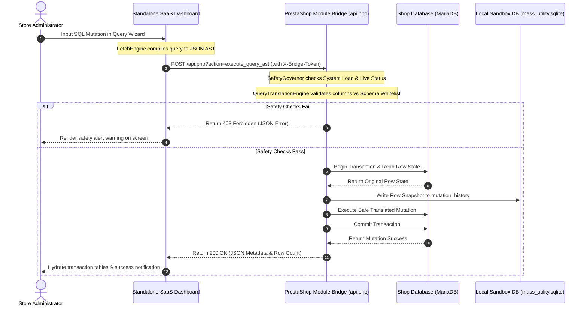

# 🗃️ Mass Utility - Production Engineering Manual

Welcome to the **Mass Utility Framework**, an enterprise-grade, zero-trust decoupled administration suite designed for PrestaShop. 

This framework separates your **Presentation/SaaS Dashboard UI** from your **PrestaShop Active Core** using a secure, transactional HTTP Bridge API. By segregating complex operations (like AST database operations, chunked backups, search index sweeps, and local transaction log rollbacks) from the main database execution stream, Mass Utility preserves database speed while offering maximum operational security.

---

## 📊 1. System Architecture & Data Flows

Mass Utility is structured as a decoupled monorepo containing two key components: the **Native PrestaShop Module** (acting as the transactional engine and API endpoint) and the **SaaS Dashboard** (acting as the administrative portal).



### Monorepo Components
*   **`mass_utility/` (PrestaShop Module)**: Houses the local Bridge API (`api.php`), the `QueryTranslationEngine` compiler, database backup chunk engines, Google Drive API upload clients, and safety thresholds.
*   **`mass_utility_dashboard/` (Standalone SaaS App)**: A lightweight PHP router (`public/index.php`) and a single-page administration app powered by modern CSS variables and modular ES6 JavaScript controllers.


---

## 🔒 2. Security & Authentication Matrix

To guarantee that no external actors can execute arbitrary database edits or access files, the Bridge API enforces a zero-trust verification boundary:

### 2.1 Header Authentication
Every request transmitted to `mass_utility/api.php` must carry the following headers:
*   `X-Bridge-Token`: Contains the secure authorization hash. This must match the `PM_SECURE_TOKEN` configuration key stored in the PrestaShop database.
*   `X-Bridge-Version`: Tells the Bridge what API schema version is being requested. The gateway strictly validates that this value matches `1.0.0` (as asserted on line 11 in `api.php`).

### 2.2 One-Time Token (OTT) Redirect Flow
When the administrator clicks the **Manage Suite** button inside the PrestaShop Admin Panel, the module generates a secure redirect URL:
1.  The module compiles an temporary token stored in the database with a **60-second Time-To-Live (TTL)**.
2.  The admin is redirected to `https://dashboard-url.com/index.php?ott=<token>`.
3.  The SaaS Router validates the OTT against the Bridge API. If valid, it hydrates a PHP session and issues a local JWT cookie to the administrator's browser.

### 2.3 IP Restriction Gateway
By default, the Bridge API restricts incoming traffic to:
1.  The server's local loopback IP (`127.0.0.1` / `::1`).
2.  Whitelisted administrator IPs configured under **Settings**.
3.  The IP address matching the resolved domain of the Standalone SaaS Dashboard.

---

## 🛠️ 3. Installation & Setup Guide

### 3.1 PrestaShop Module Installation (`mass_utility`)
1.  Compress the `mass_utility/` folder into a standard zip archive: `mass_utility.zip`.
2.  Log into your PrestaShop Admin Backoffice.
3.  Navigate to **Modules** $\rightarrow$ **Module Manager** and click **Upload a Module**.
4.  Upload `mass_utility.zip`.
5.  Upon successful installation, click **Configure** to generate your secure token and view your Bridge API URL (e.g. `https://yourshop.com/modules/mass_utility/api.php`).

### 3.2 SaaS Dashboard Installation (`mass_utility_dashboard`)
1.  Upload the contents of the `mass_utility_dashboard/` folder to a standalone subdomain folder (e.g., `/home/username/public_html/mass_utility_dashboard`).
2.  Verify your server has the **SQLite3 extension** enabled for PHP.
3.  Ensure the `.sandbox/` directory inside `mass_utility_dashboard/` has **write permissions (0755 or 0775)** enabled, allowing the application to initialize the SQLite configuration database.
4.  Access the dashboard domain in your browser. You will be automatically routed to the **Setup Wizard**.
5.  Input your PrestaShop Bridge URL and paste the `PM_SECURE_TOKEN` generated by your PrestaShop module to establish the handshake connection.

---

## 🔌 4. API Gateway Reference (api.php & index.php)

The system routes operations through a two-tier decoupled API structure: Dashboard AJAX endpoints (local browser-to-dashboard communication) and Bridge Gateway actions (dashboard-to-PrestaShop MySQL communication).

### 4.1 Tier 1: Standalone SaaS Dashboard AJAX Actions (`index.php`)
These endpoints are sent by the admin browser UI to the Dashboard Backend (`index.php` router).

| Action Key | HTTP Method | Input payload (JSON) | Expected Success Response | Description |
| :--- | :--- | :--- | :--- | :--- |
| `hydrate_dashboard` | `POST` | None | `{"success":true,"presets":[],"logs":[]}` | Initializes the UI state, returning preset ASTs and historical logs. |
| `execute_mutations` | `POST` | `{"payload":AST_JSON,"actions":[]}` | `{"success":true,"affected_count":12,"done":true}` | Parses the Query Wizard criteria, chunk-paginates matching IDs, and applies updates. |
| `rollback_mutation` | `POST` | `{"job_id":"job_123"}` | `{"success":true,"message":"Rollback executed"}` | Performs a state rollback using serialized SQLite snapshots. |
| `get_mutation_history`| `POST` | `{"page":1,"limit":20}` | `{"success":true,"items":[]}` | Retrieves local SQLite transaction records. |
| `get_auth_status` | `POST` | None | `{"success":true,"licensed":true}` | Asserts handshake status and checks active licenses. |
| `clear_saas_log` | `POST` | None | `{"success":true}` | Clears the local dashboard debug logging queue. |

### 4.2 Tier 2: Headless Bridge API Actions (`api.php`)
These endpoints are executed by the Dashboard client to read and write PrestaShop MySQL tables.

| Action Key | HTTP Method | Input Parameters | Success Response (JSON) | Description |
| :--- | :--- | :--- | :--- | :--- |
| `ping` | `GET` | None | `{"status":"alive","client_cpu":0.05}` | Telemetry check returning CPU cores, memory limits, and PHP settings. |
| `get_catalog_stats` | `GET` | None | `{"success":true,"products":42}` | Fast count profiles for active products and categories. |
| `get_categories` | `GET` | `{"id_lang":1}` | `{"success":true,"categories":[]}` | Returns a lookup tree of active categories. |
| `query_products` | `POST` | `{"ast":AST_JSON}` | `{"success":true,"product_ids":[]}` | Translates AST criteria and returns all matching target product IDs. |
| `db_query` | `POST` | `{"sql":"...","method":"executeS"}`| `{"success":true,"result":[]}` | Safe execution gateway for reading schemas. |
| `execute-chunk` | `POST` | `{"queries":[]}` | `{"success":true,"client_cpu":0.1}` | Executes an array of SQL updates wrapped in a single database transaction. |

#### Sub-Controller Action Routing (Bridge Core)
*   **Database Management (`DatabaseApiController.php`)**: Mapped to actions `create_backup`, `prepare_restore`, `execute_restore_chunk`, `diff_table_rows`, `profile_database`, and `optimize_table`.
*   **File Backups (`FileToolsApiController.php`)**: Mapped to actions `start_file_backup`, `get_file_backups`, `clear_file_backups`, and `delete_file_backup`.
*   **Google Drive Cloud Sync (`GoogleDriveApiController.php`)**: Mapped to actions `save_google_tokens`, `init_sync_to_drive`, `upload_sync_chunk`, and `finalize_sync`.
*   **Maintenance Sweepers (`SweeperApiController.php`)**: Mapped to actions `sweeper_analyze`, `sweeper_sweep_connections`, `sweeper_sweep_guests`, and `sweeper_sweep_carts`.

---

## ⚙️ 5. Subsystem Architecture Deep-Dives

### 5.1 The Safety Governor (`GovernorEngine`)
The Safety Governor acts as the gatekeeper preventing destructive resource starvation or data loss:
*   **System Load Averages**: Prior to starting large chunked backups or sweeps, the governor evaluates `sys_getloadavg()`. If the 1-minute CPU load average exceeds `4.5` (or a custom threshold), the operation is halted, returning an HTTP 503 response.
*   **Shop Mode Sentinel**: If PrestaShop is currently in "Live" mode (allowing customers to complete checkouts), the governor blocks all destructive query mutations (such as table drops, alters, or global deletions) on transactional tables (like `ps_orders`, `ps_customer`). These actions require the shop to be toggled to "Maintenance Mode" first.
*   **Table Categorization Schema**:
    *   *System Critical*: `ps_orders`, `ps_customer`, `ps_configuration` (Writes require maintenance mode).
    *   *Safe Metadata*: `ps_product`, `ps_category`, `ps_attribute` (Writes allowed live).
    *   *Disposable logs*: `ps_guest`, `ps_connections`, `ps_cart` (Sweeps allowed live).

### 5.2 AST Translation & Rollback Compilation (`QueryTranslationEngine`)
The AST mutation builder translates abstract JSON representations of query statements back into safe, platform-native SQL execution blocks:
1.  **JSON AST Validation**: Ensures keys like `target_table`, `mutation_type`, `where_conditions`, and `update_values` conform to schema specifications.
2.  **Schema Whitelisting**: Resolves columns against the actual active MariaDB column definitions in the database. Any fields not explicitly matching are stripped, eliminating column-injection attack vectors.
3.  **Rollback Telemetry**: Prior to running an `UPDATE` or `DELETE` query, the engine issues a selective `SELECT` statement mapping the target rows. These are serialized into a JSON array and saved to `.sandbox/mass_utility.sqlite` under `mutation_history` alongside the counter-query template required to revert the rows.

### 5.3 Time-Resilient Table Backups (`TableBackupManager`)
To prevent PHP script limits (like `max_execution_time` timeouts) from interrupting database backups on large databases, backups are paginated in chunks:
*   **Chunked Pagination**: Tables are read in fixed offsets (e.g. 5,000 rows at a time).
*   **Gzip Stream Compression**: Output SQL insert rows are written directly into a `.sql.gz` stream.
*   **Google Drive Multipart Upload**: Files exceeding 5MB are split and uploaded to the Google Drive API in sequential chunks with progress logging. If a chunk fail occurs, the OAuth client retries the specific chunk rather than restarting the entire file upload.

---

## 💾 6. SQLite Database Schema Reference

The Standalone SaaS Dashboard maintains its operational state inside the ignored local database located at `mass_utility_dashboard/.sandbox/mass_utility.sqlite`.

### Table: `settings`
Tracks configuration states and active tokens:
```sql
CREATE TABLE settings (
    key_name TEXT PRIMARY KEY,
    value_content TEXT NOT NULL,
    updated_at TIMESTAMP DEFAULT CURRENT_TIMESTAMP
);
```

### Table: `presets`
Stores reusable AST templates generated by the Query Wizard:
```sql
CREATE TABLE presets (
    id INTEGER PRIMARY KEY AUTOINCREMENT,
    preset_name TEXT UNIQUE NOT NULL,
    description TEXT,
    ast_json TEXT NOT NULL,
    created_at TIMESTAMP DEFAULT CURRENT_TIMESTAMP
);
```

### Table: `mutation_history`
Tracks query actions and rollback snapshots:
```sql
CREATE TABLE mutation_history (
    id INTEGER PRIMARY KEY AUTOINCREMENT,
    query_raw TEXT NOT NULL,
    table_target TEXT NOT NULL,
    rows_affected INTEGER NOT NULL,
    rollback_json TEXT NOT NULL,
    timestamp INTEGER NOT NULL
);
```

---

## 🔧 7. Troubleshooting & Operational Guide

### 7.1 Reclaiming Access After a Safety Lockout
If the CPU load is high or the shop state is misidentified, you can temporarily bypass the Safety Governor:
1.  Log into your server via SSH.
2.  Navigate to the `mass_utility/` folder.
3.  Create an empty file named `.bypass_governor` in the module directory:
    `touch .bypass_governor`
4.  This bypasses the Safety Governor checks for 15 minutes before the sentinel auto-removes the file.

### 7.2 Recovering a Interrupted Gzip Restore
If a database restoration stops mid-process:
1.  Check `mass_utility/logs/backup.log` to identify the last successfully imported chunk index and line offset.
2.  Ensure your `post_max_size` and `upload_max_filesize` in `php.ini` are set to at least `128M`.
3.  Restart the restore process from the specific chunk index offset using the dashboard recovery panel.
