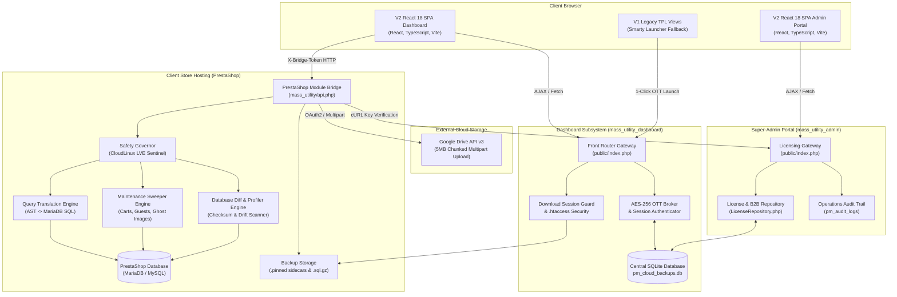
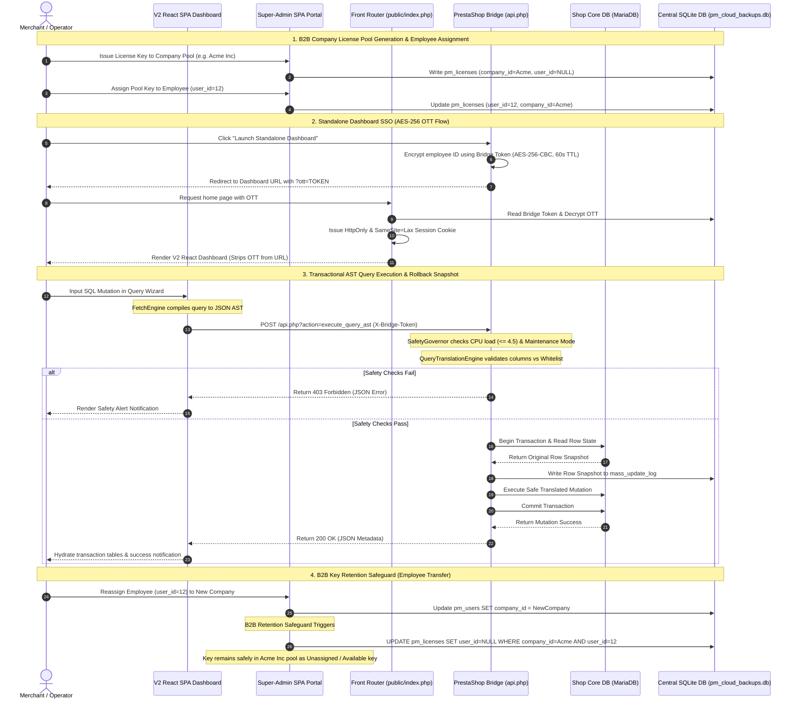
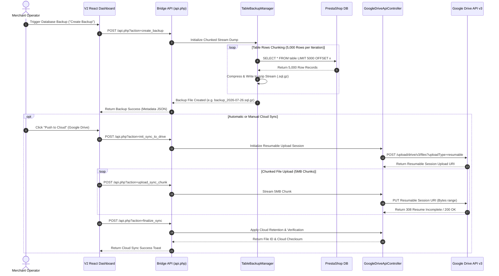
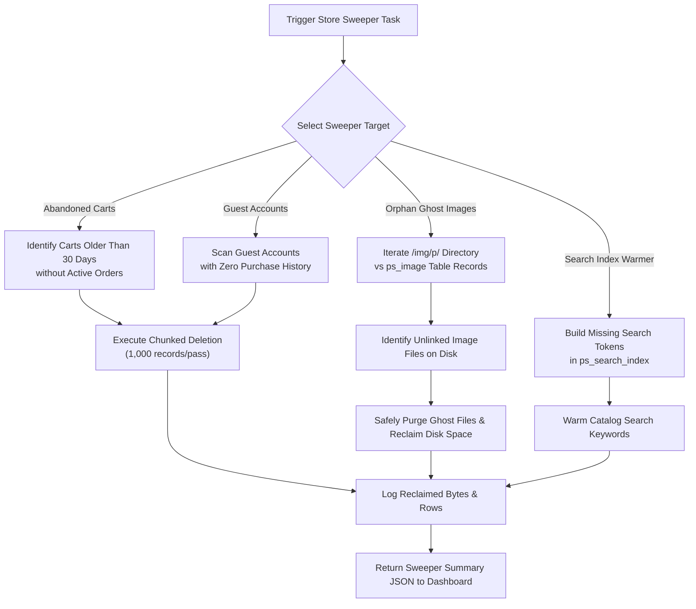
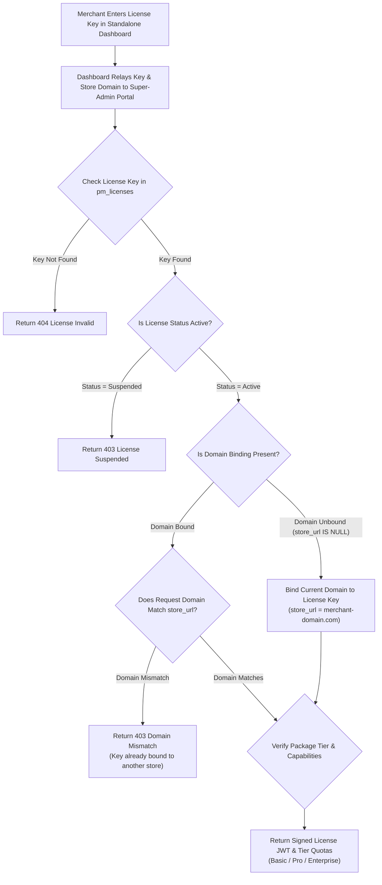
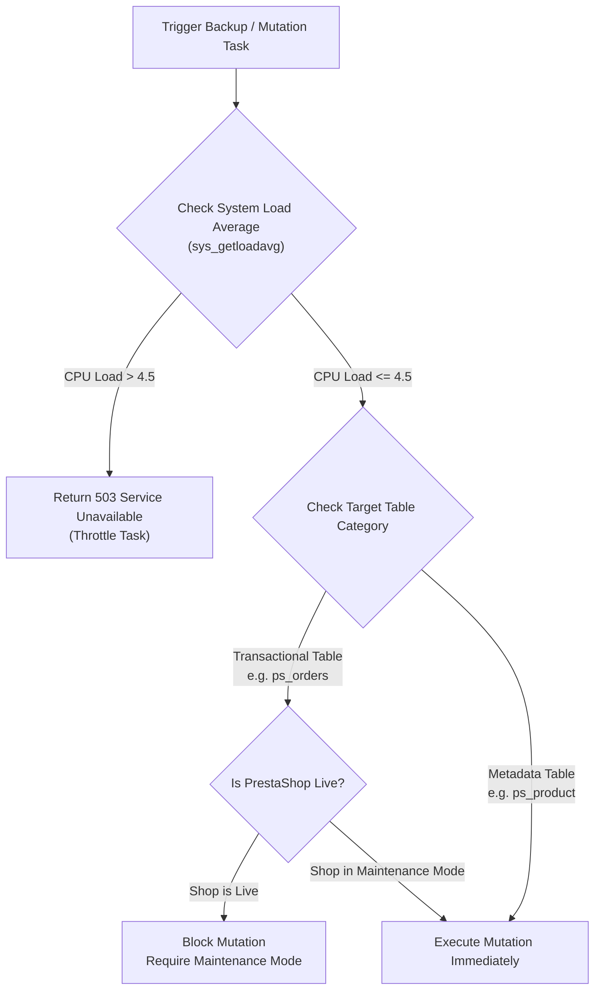

# 🗃️ Mass Utility - Consolidated Technical Manual & Reference Guide

Welcome to the **Mass Utility Framework**, an enterprise-grade, zero-trust decoupled administration suite and B2B SaaS licensing infrastructure designed for PrestaShop.

This framework separates your **Presentation / SaaS Dashboard UI (V2 React 18 SPA)** and **Super-Admin Licensing Portal (V2 React 18 SPA)** from your **PrestaShop Active Core** using a secure, transactional HTTP Bridge API. By segregating complex operations (such as AST database operations, chunked backups, search index sweeps, B2B license pool management, orphan ghost image purging, database drift profiling, cloud storage sync, and local transaction log rollbacks) from the main database execution stream, Mass Utility preserves store speed and hosting limits while offering maximum operational security.

---

## 📊 1. Comprehensive System Architecture & Interconnectivity

Mass Utility is structured as a decoupled monorepo containing three primary subsystems:
1. **Native PrestaShop Module (`mass_utility/`)**: The transactional bridge executing operations on PrestaShop core tables (MariaDB) and enforcing CloudLinux LVE safety bounds.
2. **Standalone SaaS Dashboard (`mass_utility_dashboard/`)**: The modern V2 Single-Page Application (SPA) built with **React 18 + TypeScript + Vite** used by merchant operators to write AST queries, manage files, inspect diffs, profile schemas, clean system clutter, and control backup repositories.
3. **Super-Admin Licensing & B2B Portal (`mass_utility_admin/`)**: The centralized licensing server and B2B directory used by system operators to manage company profiles, issue company license pools, reassign team members, enforce domain bindings, inspect infrastructure security, and view real-time operations audit trails.

---

### 1.1 Decoupled Component & Layering Architecture



---

### 1.2 End-to-End Handshake & Execution Sequence



---

### 1.3 Chunked Database Backup & Google Drive Cloud Sync Workflow



---

### 1.4 Automated PrestaShop Store Maintenance & Image Sweeper Pipeline



---

### 1.5 B2B Multi-Tenant Company Pool & Domain License Verification Flow



---

## 🎨 2. User Interface Architecture & Design System

The Mass Utility Framework enforces a unified **V2 React 18 SPA Architecture & Design System Policy**:

### 2.1 Single UI, PrestaShop Launcher & Standalone Demo Mode Integration
- **V2 React 18 SPA Dashboard**: Primary merchant interface located in `mass_utility_dashboard/frontend/` and compiled directly to `mass_utility_dashboard/public/v2/`.
- **V2 React 18 SPA Super-Admin**: Primary licensing & tenant operations interface located in `mass_utility_admin/frontend/` and compiled directly to `mass_utility_admin/public/v2/`.
- **PrestaShop Back-Office Launcher Card**: Clean, native PrestaShop Smarty template (`mass_utility_dashboard/views/templates/admin/configure.tpl`) providing 1-click AES-256 OTT redirection from PrestaShop Back-Office directly to the V2 Standalone Dashboard.
- **Standalone Public Demo Mode (`/v2/index.html`)**: Both SPAs feature automatic `/v2/` URL path auto-detection. Requests targeting `/v2/` bypass PrestaShop session checks via PHP Gateway `$isDemoRequest` and execute 100% in browser JS memory (`FetchService.ts` & `AdminFetchAdapter.ts`). Features interactive high-contrast dual-theme amber (`mass_utility_admin`) and purple (`mass_utility_dashboard`) vault status banners with `🔄 Reset Vault` and `🚪 Exit Demo` controls.

### 2.2 Dashboard V2 React Component Architecture (`mass_utility_dashboard/frontend/src/components/`)
- `<QueryMutateTab>` & `<QueryWizardTab>` (`🛒 Mass Updates`): Visual AST query builder with live SQL preview, domain preset loadout bar, and execution simulation mode.
- `<MutationHistoryTab>` (`🕒 Mutation History`): Historical execution ledger featuring the **MariaDB SQL Reconstruction Engine** (`sqlReconstructor.ts`), revert payload inspect modal, and 1-click rollback execution.
- `<DatabaseToolsTab>` (`🗄️ Database Tools`): Schema inspection, direct query runner, table fragmentation auditing, index optimization, and Database Diff drift analysis modal.
- `<FileToolsTab>` & `<BackupsGrid>` (`📁 Files & Backups`): Filesystem backup manager, folder exclusion tree selector, Google Drive cloud sync status, and time-resilient backup management featuring the **`.pinned` Sidecar Metadata Subsystem**.
- `<MerchantSecurityTab>` (`🛡️ Security & Health`): Top-level merchant security inspector featuring 4 diagnostic cards (HTTP Headers, PrestaShop Core & SSL, Filesystem Permissions, Executive System Health) with 1-click repairs (**`[🔒 Apply .htaccess Headers]`**, **`[📁 Repair Permissions]`**, **`[⚡ Enforce Store SSL]`**).
- `<EventLogsTab>` (`📜 Event Logs`): Searchable audit trail for system operations and Bridge API communication logs.
- `<GovernorTab>` (`⚡ Safety Governor`): Real-time CloudLinux LVE telemetry dashboard featuring **Zero-CLS Instant Skeleton Frame Architecture**.
- `<SettingsTab>` (`⚙️ Settings`): Dashboard configuration, license key details, Google Drive authentication modal, and connection status settings.

### 2.3 Super-Admin V2 React Component Architecture (`mass_utility_admin/frontend/src/components/`)
- `<CompanyListView>` & `<CompanyDetailsView>`: **Companies Directory** featuring real-time license utilization meters (`usedCount` / `max_licenses`), Company Suspend/Activate action button with `<ConfirmModal>` integration, Dual-Mode tab switcher (`[📊 Overview]` vs `[⚙️ Edit Profile & Settings]`), 1-click pool key generator, normalized Onboard Team Member mode toggle onto an animated GPU segmented pill, extracted `<CompanyHeaderStats>` component for profile capacity metrics, master `<PaginationBar>`, `<TableCellIdentity>`, `<TableCellActions>`, and employee assignment select dropdowns.
- `<ClientListView>` & `<ClientDetailsView>`: **Clients Directory** featuring Client Full Name (`name`) support, Company Dropdown client reassignment, sub-page header Company Affiliation badge (`🏢 Company Name` with 1-click navigation), Dual-Mode tab switcher (`[📊 Overview & Keys]` vs `[⚙️ Edit Client & Settings]`), extracted `<ClientCredentialsBanner>` for 1-click credential copy dialogs, password masking toggles (`<Eye />` / `<EyeOff />`), master `<PaginationBar>`, `<TableCellIdentity>`, `<TableCellActions>`, and Company Pool Ownership badges.
- `<LicensesTab>` & `<LicenseDetailsView>`: **License Registry & Subscriptions** featuring high-density 36px data rows (`<LicenseRowCard>`) with expandable drawer chevrons (`▼` / `▲`), extracted `<ReassignLicenseModal>`, 8-column standardized alignment, `<TableCellIdentity>` (2-row identity cell), `<TableCellActions>` with 🟠 Amber Suspend and 🟢 Emerald Activate action pills, `<ConfirmModal>` safety shield, 4-card telemetry grid, `Company Owner` column, `Assigned Employee` column, nested card `<PaginationBar>`, domain binding inspector, and 1-click key masking.
- `<PackageTiersTab>`: **Package Editor & Tier Matrix** featuring sub-tab label `'Package Editor'`, Tier Overview selector, and dynamic Selected Package Feature & Quota Matrix Card displaying active/inactive capability checkboxes and daily quota limits for `basic`, `pro`, `enterprise` subscription tiers.
- `<RolesTab>` & `<CapabilitySimulator>`: **Roles & Security Governance** featuring global RBAC role creation, custom capability permission tables, contextual **`(?) Glossary`** button embedded in section headers, and the **Live Effective Capability Simulator** calculating real-time merged role permissions.
- `<SecurityHealthTab>`: Super Admin 4-Card Security Grid auditing SaaS server infrastructure (HSTS, SSL 301 Redirect Enforcer, Vault Isolation `pm_cloud_backups.db` 403, SaaS Server Filesystem Permissions) with extracted `<SecurityAuditGrid>`.
- `<AuditLogsTab>`: **Operations Audit Trail** featuring search & filter toolbar, extracted `<AuditLogPayloadModal>` for raw JSON inspection, **`[Clear Audit Logs]`** with red `<ConfirmModal>` confirmation safety prompt, master `<PaginationBar>`, CSV log exporter link (`?action=api_export_admin_logs_csv`), and Light/Dark adaptive code terminal.
- `<SettingsTab>`: Full-width 2-column side-by-side password form layout with icon inputs (`<FormInput type="password" icon={Lock} />`).

### 2.4 Normalized Interactive UX Features & Primitives
- **Standardized Identity Cell (`<TableCellIdentity>`)**: Reusable table identity cell primitive (`src/components/common/TableCellIdentity.tsx`) rendering primary titles in `font-extrabold text-sm text-pm-text` and subtitles in non-bold, normal-weight text (`font-normal font-mono text-xs text-pm-secondary/80`). Standardizes identity layout across Companies, Clients, and Licenses.
- **Standardized Row Actions (`<TableCellActions>`)**: Reusable table row action buttons primitive (`src/components/common/TableCellActions.tsx`) standardizing `Inspect` (`variant="neutral"`), `Suspend / Activate` (🟠 `variant="warning"` Amber Orange / 🟢 `variant="success"` Emerald Green), and `Delete` (🔴 `variant="danger"` Rose Red) across all directory tables with 100% sizing and transition parity.
- **URL Hash Tab Navigation & State Restoration**: `App.tsx` reads and syncs `window.location.hash` (`#companies`, `#clients`, `#licenses`, `#tiers`, `#settings`, `#security`, `#audit`), maintaining active tab state seamlessly across browser refreshes (`F5`) and Back/Forward navigation.
- **Master Data Table Pagination (`<PaginationBar>`)**: Standardized data table pagination with dynamic page size options (`10`, `25`, `50`, `100`), `< Previous` / `Next >` navigation, and real-time item counter nested seamlessly inside the bottom border of all listing table cards (`border-t border-pm-border`).
- **Safety Confirmation Shield (`<ConfirmModal>`)**: Modal overlay shield for high-impact actions (Suspend, Activate, Delete Company/Client, Clear Audit Logs) featuring backdrop blur (`backdrop-blur-md z-[9999999]`), `top-0 left-0 w-screen h-screen` bounds, and variant-specific color schemes (`danger`, `warning`, `info`).
- **Enhanced Select Dropdowns (`<FormSelect>`)**: Standardized custom dropdown primitive featuring custom SVG chevron arrow icons, hover/focus rings (`focus:border-pm-primary focus:ring-1 focus:ring-pm-primary/30`), and option styling.
- **Normalized Bottom-Right Toast Engine**: Notifications across both portals are positioned at **Bottom-Right** (`fixed bottom-5 right-5 z-[999999]`), featuring dark backdrop blur (`backdrop-blur-md`), elevated drop shadows (`shadow-2xl`), left status accent borders (`border-l-4`), and an instant manual dismissal button (`<X />`).
- **Animated Refresh Feedback**: Toolbar Refresh buttons feature an active spinning animation (`<RefreshCw className="animate-spin text-purple-400" />`), disabled click states, and success toast responses across all directory tabs.
- **Interactive Password Visibility Toggles**: All password input fields feature interactive `<Eye />` / `<EyeOff />` toggles.

### 2.5 Design System & System Tokens (`index.css`)
All V2 React components inherit from unified CSS design tokens (`var(--pm-*)`):
- **Theme Variables**: `--pm-body-bg`, `--pm-card-bg`, `--pm-input-bg`, `--pm-border-color`, `--pm-text-primary`, `--pm-text-secondary`, `--pm-primary`, `--pm-success`, `--pm-danger`.
- **Harmonized Dark & Light Mode Adaptation**: Root level `color-scheme: dark` (`--pm-body-bg: #0b0c10`, `--pm-card-bg: #12131c`, `--pm-border-color: #242636`, `--pm-input-bg: #181926`) and `color-scheme: light` coupled with custom WebKit scrollbars (`::-webkit-scrollbar`).
- **3-Tier Action Button Hierarchy**:
  - **Tier 1 (Primary Action)**: `.pm-btn-primary` (Solid accent color for main actions like `🔄 Revert` or `☁️ Push to Cloud`).
  - **Tier 2 (Secondary Actions)**: `.pm-btn-neutral` (Subtle theme pills for non-destructive actions like `👁️ Inspect`, `📥 Download`, `📌 Pin`).
  - **Tier 3 (Destructive / Warning Actions)**: `variant="warning"` (Amber Orange pill), `variant="success"` (Emerald Green pill), `.pm-btn-danger-outline` / `variant="danger"` (Rose Red pill for `🗑️ Delete`).

---

## 📁 3. Monorepo Repository Structure

```
d:/Project Mass/
├── WORKSPACE.md                    # Workspace constitution and directory manifest
├── README.md                       # Master consolidated technical manual
├── SPEC.md                         # Master technical specifications & contracts
├── CHANGELOG.md                    # Release history & version logs
├── SECURITY.md                     # Security reporting policy & disclosure
├── CONTRIBUTING.md                 # Developer onboarding & git guidelines
├── .gitignore                      # Workspace ignore rules (DBs, logs, build outputs)
│
├── mass_utility/                   # NATIVE PRESTASHOP MODULE (Transactional Bridge)
│   ├── mass_utility.php            # Module installer, hooks, back-office controller
│   ├── api.php                     # Unauthenticated gateway receiver for Dashboard API calls
│   ├── backups/                    # Storage directory protected by .htaccess (Require all denied)
│   ├── bin/                        # CLI maintenance scripts (cli_backup.php, cli_restore.php)
│   └── src/
│       ├── Controller/Api/
│       │   ├── AbstractApiController.php   # Base API controller with authentication & JSON helpers
│       │   ├── DatabaseApiController.php   # Backups, SQL dumps, table diffs, database profiling
│       │   ├── FileToolsApiController.php  # Filesystem backups, tree browsing, exclusions
│       │   ├── GoogleDriveApiController.php# OAuth2 tokens, 5MB chunked cloud sync, cloud restores
│       │   ├── SweeperApiController.php    # Carts, guest accounts, ghost images, index warming
│       │   └── SystemApiController.php     # Diagnostics, security perms, SSL enforcer, live status
│       ├── Engine/
│       │   ├── DatabaseDiffEngine.php      # Checksum drift comparison & table diff engine
│       │   └── QueryTranslationEngine.php  # AST compiler, query whitelist, rollback compiler
│       └── Service/
│           ├── BridgeLogger.php            # Structured JSON & file logger
│           ├── BridgeProgressTracker.php   # Long-running job state & progress telemetry
│           ├── DatabaseProfilerEngine.php  # Table optimization, index auditing, fragmentation scanner
│           ├── FileBackupEngine.php        # Chunked zip/tar file archive compiler
│           ├── GoogleDriveClient.php       # Google Drive API v3 OAuth & upload client
│           ├── MaintenanceSweeperEngine.php# Orphan image scanner, cart cleaner, index warmer
│           ├── MassUpdateCommand.php       # CLI transactional AST query runner
│           ├── ResourceMonitor.php         # Memory, disk, and CPU load monitoring
│           ├── SaaSSQLEscaper.php          # SQL query escaping & sanitizer
│           ├── SettingsManager.php         # PrestaShop configuration store adapter
│           └── TableBackupManager.php      # Paginated 5,000-row chunked database dumper
│
├── mass_utility_dashboard/         # MERCHANTS CLIENT PORTAL (Standalone Dashboard)
│   ├── backups/                    # Dashboard local backup storage protected by .htaccess
│   ├── data/                       # Central SQLite database (pm_cloud_backups.db)
│   ├── frontend/                   # V2 REACT 18 + TYPESCRIPT + VITE SPA SOURCE
│   │   ├── src/
│   │   │   ├── components/         # React Tab Orchestrators & Feature Panels
│   │   │   │   ├── database/       # DatabaseToolsTab.tsx (Diff modal, query runner, profiler)
│   │   │   │   ├── file_tools/     # FileToolsTab.tsx, BackupsGrid.tsx, FolderSelector.tsx
│   │   │   │   ├── governor/       # GovernorTab.tsx, BackupProgress.tsx
│   │   │   │   ├── history/        # MutationHistoryTab.tsx, EventLogsTab.tsx
│   │   │   │   ├── query/          # QueryMutateTab.tsx, PresetLoadoutBar.tsx
│   │   │   │   ├── security/       # MerchantSecurityTab.tsx (4-Card inspector & 1-click repairs)
│   │   │   │   ├── settings/       # SettingsTab.tsx, SettingsGeneral.tsx, SettingsSecurity.tsx
│   │   │   │   └── common/         # Atomic UI Primitives (SectionHeader, BaseModal, DataTable)
│   │   │   ├── utils/              # sqlReconstructor.ts, FetchService.ts
│   │   │   └── index.css           # Design tokens, cross-browser scrollbars (.pm-scrollbar)
│   │   ├── package.json            # Vite build scripts
│   │   └── vite.config.ts          # Vite build configuration (outputs to public/v2/)
│   ├── public/
│   │   ├── index.php               # Front Router, OTT decryptor, Session Guard & Download Interceptor
│   │   └── v2/                     # Compiled V2 React SPA static assets (index.html, JS, CSS)
│   └── src/
│       ├── Controller/Api/         # Dashboard API endpoints
│       └── Service/
│           ├── SQLiteConnectionManager.php # SQLite PDO manager with busy timeout & WAL fallback
│           └── TenantSettingsRepository.php# Settings repository with KV cache
│
└── mass_utility_admin/             # SUPER-ADMIN LICENSING & B2B PORTAL
    ├── public/
    │   ├── index.php               # Licensing gateway, activate_key endpoint & admin router
    │   └── v2/                     # Compiled V2 Super-Admin React SPA static assets (index.html, JS, CSS)
    ├── src/
    │   ├── Controller/
    │   │   └── AdminApiController.php # Admin API dispatcher (login, list, create/update company/user/tier)
    │   ├── Repository/
    │   │   └── LicenseRepository.php  # License, company, and user CRUD with B2B retention safeguard
    │   └── Service/
    │       ├── SQLiteConnectionManager.php # Singleton PDO factory for SQLite connection & WAL mode
    │       └── AdminSettingsManager.php # Settings manager & self-healing SQLite schema auto-migrations
    └── frontend/                   # V2 REACT 18 + TYPESCRIPT + VITE SPA SOURCE
        └── src/
            ├── components/         # CompaniesTab, ClientsTab, LicensesTab, PackageTiersTab, RolesTab, AuditLogsTab
            │   ├── audit_logs/     # AuditLogPayloadModal.tsx
            │   ├── clients/        # ClientListView.tsx, ClientDetailsView.tsx, ClientCredentialsBanner.tsx
            │   ├── companies/      # CompanyListView.tsx, CompanyDetailsView.tsx, CompanyHeaderStats.tsx
            │   ├── licenses/       # LicenseDetailsView.tsx, ReassignLicenseModal.tsx
            │   ├── roles/          # CapabilitySimulator.tsx
            │   ├── security/       # SecurityAuditGrid.tsx
            │   └── common/         # TableCellIdentity, TableCellActions, ConfirmModal, LicenseRowCard
            ├── hooks/              # useAdminData.ts (Custom React hook encapsulating state)
            ├── types/              # adminApi.ts (Central TypeScript domain models)
            └── utils/              # tierUtils.ts, licenseUtils.ts
```

---

## 🔒 4. Security, Zero-Trust & Audit Architecture

### 4.1 Headless Bridge Authentication
All requests hitting the PrestaShop Module Bridge (`mass_utility/api.php`) must carry:
- `X-Bridge-Token`: Matches the locally stored PrestaShop configuration value (`PM_SECURE_TOKEN`).
- `X-Bridge-Version`: Must assert exact compatibility with schema version `1.0.0`.

### 4.2 One-Time Token (SSO / OTT) AES-256 Redirect Flow
When the merchant administrator clicks **Launch Standalone Dashboard** in PrestaShop Back Office:
1. **Encryption**: The module encrypts the employee ID, bridge token, and an expiry timestamp (60s TTL) using `AES-256-CBC`.
2. **Redirect**: Redirects to `https://dashboard-url.com/?ott=<encrypted_token>`.
3. **Decryption**: The dashboard backend reads the bridge token from SQLite, decrypts the payload, verifies timestamp validity, and sets a hardened session.
4. **URL Scrubbing**: The OTT parameter is stripped immediately from the browser URL bar, neutralizing replay attacks.

### 4.3 Authenticated Download Session Guard ([public/index.php](file:///d:/Project%20Mass/mass_utility_dashboard/public/index.php#L150-L160))
Top-level direct file download interceptors (`download_backup`, `download_file_backup`, `download_file_backup_log`, `download_from_drive`) require an active authenticated session (`!empty($_SESSION['employee_id'])`). Unauthenticated requests are rejected with HTTP 403 Forbidden.

### 4.4 Direct Access Web Restriction (`.htaccess`)
Direct web access to backup storage directories (`mass_utility/backups/` and `mass_utility_dashboard/backups/`) is blocked via `.htaccess`:
```apache
<IfModule mod_authz_core.c>
    Require all denied
</IfModule>
<IfModule !mod_authz_core.c>
    Deny from all
</IfModule>
```
*Note: PHP scripts on the server use internal filesystem access (`readfile()`), bypassing HTTP `.htaccess` blocks to stream downloads securely to authenticated users.*

### 4.5 SaaS Server 4-Card Security Inspector & 1-Click Repairs
The Super Admin Portal includes a 4-Card Infrastructure Security Inspector (`SecurityHealthTab.tsx`):
- **Card 1: HTTP Security Headers**: Checks HSTS, `X-Content-Type-Options: nosniff`, `X-Frame-Options: SAMEORIGIN`, `Referrer-Policy`. Includes 1-click repair (`[🔒 Apply Security Headers]`).
- **Card 2: SSL 301 HTTPS Enforcer**: Checks whether HTTP requests automatically redirect to HTTPS. Includes 1-click repair (`[⚡ Enforce SSL Redirect]`).
- **Card 3: Vault Storage Isolation**: Verifies `pm_cloud_backups.db` returns 403 Forbidden via HTTP.
- **Card 4: SaaS Filesystem Permissions**: Audits directory (`0755`) and file (`0644`) permissions. Includes 1-click repair (`[📁 Repair Permissions]`).

### 4.6 Super-Admin Operations Audit Trail & CSV Exporter (`AuditLogsTab.tsx`)
System actions executed across the Super-Admin portal are logged to `pm_audit_logs`:
- **Real-Time Audit Terminal**: Renders filterable operation logs with Light/Dark adaptive code blocks displaying raw JSON event context.
- **CSV Log Exporter**: Includes a 1-click CSV download link (`?action=api_export_admin_logs_csv`) allowing administrators to export historical audit trails for compliance.
- **Safety Confirmation Shield**: Clearing audit logs (`?action=api_clear_admin_logs`) is protected by a red `<ConfirmModal>` backdrop shield.

### 4.7 Automated Security Audit Pipeline (`cli_security_audit.py`)
Integrated into the pre-commit build pipeline, `cli_security_audit.py` scans JavaScript files for unsafe DOM injections (`innerHTML`), verifies `escapeshellarg()` on PHP shell executions, and audits SQLite queries for prepared statement compliance.

### 4.8 Public Demo Sandbox & OWASP Threat Mitigation Architecture
When deployed on live public web hosts, Standalone Demo Mode (`/v2/index.html`) operates under strict OWASP zero-trust air-gap isolation:
- **100% Client-Side In-Memory Dispatching:** `FetchService.ts` and `AdminFetchAdapter.ts` trap all AJAX requests (`execute_query`, `start_file_backup`, `rollback_mutation`) inside client browser JS memory. Zero network calls touch the remote PHP backend or store MySQL/SQLite databases (0 server resource impact).
- **Backend API Authorization Guard:** Raw API requests (`index.php?action=...`) sent directly to the PHP backend lack the `/v2/` URL path, causing `$isDemoRequest` to evaluate to `false`. Unauthenticated API calls are immediately blocked by the PHP Gateway with **HTTP 403 Forbidden**.
- **Credential Protection:** Client JS bundles contain only synthetic mock demonstration strings (`PM-DEMO-ENTERPRISE-KEY`, `admin@company.com`). Zero production credentials, secrets, or real database passwords exist within client assets.

---

## 🛠️ 5. MariaDB AST Query & SQL Reconstruction Engine

### 5.1 Abstract Syntax Tree (AST) Payload Structure
Instead of accepting raw SQL strings from the frontend, the Query Wizard generates a structured JSON AST payload:
```json
{
  "target_table": "ps_product_shop",
  "mutation_type": "UPDATE",
  "update_fields": {
    "price": "price * 1.10",
    "active": 1
  },
  "where_conditions": [
    { "field": "id_category_default", "operator": "=", "value": 5 }
  ]
}
```

### 5.2 SQL Reconstruction & Rollback Projection (`sqlReconstructor.ts`)
The V2 React SPA includes a client-side MariaDB SQL reconstruction utility (`src/utils/sqlReconstructor.ts`):
- **Executable Query Reconstruction**: Reconstructs valid, syntax-highlighted MariaDB `UPDATE` statements from JSON AST payloads.
- **Rollback SQL Projection**: Parses `revert_payload` row snapshots captured during execution and projects the exact SQL statements required to undo the transaction.
- **1-Click Copy Buttons**: Provides 1-click clipboard copy buttons with interactive toast notifications for both JSON payloads and SQL code snippets inside the Mutation History Inspect Modal.

---

## 🧹 6. Database Maintenance & Image Sweeper Engine

The **Maintenance Sweeper Engine** (`MaintenanceSweeperEngine.php` & `SweeperApiController.php`) provides automated housekeeping for large PrestaShop stores:

### 6.1 Abandoned Cart Cleanup (`sweeper_sweep_carts`)
Scans `ps_cart` and `ps_cart_product` tables for abandoned shopping carts older than 30 days without associated completed orders (`ps_orders`). Executes chunked deletion in 1,000-record passes to prevent locking transactional tables.

### 6.2 Guest Account Purging (`sweeper_sweep_guests`)
Identifies expired guest customer accounts (`ps_guest`, `ps_connections`) with zero order history and purges unneeded session tracking data, significantly reducing database storage bloat.

### 6.3 Orphan Ghost Image Scanner & Deletion (`sweeper_scan_images` / `sweeper_purge_images`)
Iterates physical image storage on disk (`/img/p/`) and cross-references file paths against active database records in `ps_image` and `ps_product`. Unlinked "ghost" images left behind by deleted products are flagged and safely deleted from disk, reclaiming server disk space.

### 6.4 Search Index Warmer (`warmIndex`)
Scans unindexed products in `ps_product` and automatically builds missing search keywords into `ps_search_index` and `ps_search_word` in background batches, ensuring store search speed remains fast.

---

## 📊 7. Database Tools, Schema Profiler & Drift Engine

The **Database Tools & Profiler Subsystem** (`DatabaseToolsTab.tsx`, `DatabaseProfilerEngine.php`, `DatabaseDiffEngine.php`) equips merchants with advanced database health controls:

### 7.1 MariaDB Table Checksum Drift Scanner (`diff_table_rows` / `export_diff`)
Captures baseline `CHECKSUM TABLE` metrics for core PrestaShop tables. Compares current table checksums against historical snapshots to detect data drift, unauthorized manual edits, or corrupted rows. Exports line-by-line diff reports in JSON format.

### 7.2 Table Fragmentation Inspector (`get_fragmentation_status`)
Queries MariaDB `information_schema.TABLES` to measure free data space (`DATA_FREE`) vs allocated space. Displays table fragmentation percentages and alerts operators when InnoDB tables require defragmentation.

### 7.3 1-Click Table Optimization (`optimize_table`)
Executes `OPTIMIZE TABLE` commands on targeted MariaDB tables, reclaiming unused tablespace pages and updating column index cardinality statistics.

---

## 📌 8. Time-Resilient Backup Engine & Google Drive Cloud Sync

### 8.1 Chunked Backup Dumping (`TableBackupManager.php`)
To prevent PHP timeouts (`max_execution_time`) on large store databases:
- **Paginated Read**: Reads tables in 5,000-row chunks.
- **Gzip Streaming**: Compresses output directly into `.sql.gz` streams.

### 8.2 Backup Pinning Subsystem (`📌 Pin` / `📌 Unpin`)
Merchants can pin critical historical backups to prevent accidental deletion and keep them at the top of the repository grid:
- **Sidecar Metadata Files**: Pin toggles write or delete `.pinned` sidecar files (e.g. `backup_2026-07-22.sql.gz.pinned`).
- **Repository Sorting**: Server API lists read `.pinned` sidecars and sort pinned backups above unpinned entries.
- **API Controllers**: Managed via `toggle_pin_file_backup` in `FileToolsApiController.php` and `toggle_pin_backup` in `DatabaseApiController.php`.

### 8.3 Google Drive Cloud Storage Sync (`GoogleDriveApiController.php` & `GoogleDriveClient.php`)
- **OAuth2 Token Exchange**: Supports 1-click Google OAuth2 authentication flow with automatic refresh token persistence.
- **5MB Chunked Multipart Upload**: Uploads large backup archives (`.sql.gz`, `.zip`) to Google Drive in sequential 5MB chunks with automatic byte-range resumption.
- **Cloud Integrity & Restore**: Verifies Google Drive file hashes and allows 1-click downloading (`download_from_drive`) and local restoration (`restore_from_drive`) directly from Google Cloud storage.

---

## ⚡ 9. Native Safety Governor & CloudLinux LVE Telemetry



### 9.1 Real-Time CPU Load Monitoring
Evaluates server 1-minute load average before executing heavy queries. If CPU load exceeds `4.5`, the Safety Governor throttles execution to protect store performance.

### 9.2 Zero-CLS Instant Skeleton Frame Architecture
To eliminate Cumulative Layout Shift (CLS) on page refresh in `GovernorTab.tsx`:
- The Hero Card shell ("Native Safety Governor", "CloudLinux LVE" badge) renders **instantly on frame 0**.
- Dynamic telemetry values display smooth `animate-pulse bg-pm-input/50` skeleton shimmers while loading.
- Badge statuses transition smoothly to `SAFE TO OPERATE` with **zero height shifts or layout jumps (CLS = 0)**.

---

## 🗄️ 10. Centralized SQLite Database Schema Reference

All dashboard configurations, licensing data, B2B companies, query presets, and rollback snapshots are stored in `mass_utility_dashboard/data/pm_cloud_backups.db`:

```sql
-- 1. Tenant Settings Configuration
CREATE TABLE tenant_settings (
    name VARCHAR(255) PRIMARY KEY,
    value TEXT
);

-- 2. Query Wizard Presets
CREATE TABLE mass_update_presets (
    id_preset INTEGER PRIMARY KEY AUTOINCREMENT,
    name VARCHAR(255) NOT NULL,
    type VARCHAR(50) NOT NULL,
    payload TEXT NOT NULL,
    date_add DATETIME NOT NULL
);

-- 3. Mutation Execution History & Rollback Snapshots
CREATE TABLE mass_update_log (
    id_mass_update_log INTEGER PRIMARY KEY AUTOINCREMENT,
    job_id VARCHAR(64) NOT NULL,
    state VARCHAR(24) NOT NULL,
    affected_count INT DEFAULT 0,
    payload TEXT NOT NULL,
    revert_payload TEXT DEFAULT NULL,
    errors TEXT DEFAULT NULL,
    date_add DATETIME NOT NULL,
    date_upd DATETIME NOT NULL,
    UNIQUE (job_id)
);

-- 4. B2B Companies Directory
CREATE TABLE pm_companies (
    id INTEGER PRIMARY KEY AUTOINCREMENT,
    company_name VARCHAR(255) UNIQUE NOT NULL,
    tax_id VARCHAR(100) NULL,
    max_licenses INTEGER DEFAULT 10,
    status VARCHAR(32) DEFAULT 'active',
    created_at DATETIME DEFAULT CURRENT_TIMESTAMP,
    updated_at DATETIME DEFAULT CURRENT_TIMESTAMP
);

-- 5. Merchant Users / Client Accounts Registry
CREATE TABLE pm_users (
    id INTEGER PRIMARY KEY AUTOINCREMENT,
    name VARCHAR(255) NULL,
    email VARCHAR(255) UNIQUE NOT NULL,
    password_hash VARCHAR(255) NOT NULL,
    company_name VARCHAR(255) NULL,
    company_id INTEGER NULL,
    role VARCHAR(50) DEFAULT 'owner',
    status VARCHAR(32) DEFAULT 'active',
    created_at DATETIME DEFAULT CURRENT_TIMESTAMP,
    updated_at DATETIME DEFAULT CURRENT_TIMESTAMP,
    FOREIGN KEY(company_id) REFERENCES pm_companies(id) ON DELETE SET NULL
);

-- 6. License Keys & Company Pool Registry
CREATE TABLE pm_licenses (
    id INTEGER PRIMARY KEY AUTOINCREMENT,
    company_id INTEGER NULL,
    user_id INTEGER NULL,
    license_key VARCHAR(64) UNIQUE NOT NULL,
    store_url VARCHAR(255) NULL,
    package_tier VARCHAR(32) DEFAULT 'basic',
    status VARCHAR(32) DEFAULT 'active',
    expires_at DATETIME NULL,
    created_at DATETIME DEFAULT CURRENT_TIMESTAMP,
    updated_at DATETIME DEFAULT CURRENT_TIMESTAMP,
    FOREIGN KEY(company_id) REFERENCES pm_companies(id) ON DELETE CASCADE,
    FOREIGN KEY(user_id) REFERENCES pm_users(id) ON DELETE SET NULL
);

-- 7. Super-Admin Credentials
CREATE TABLE pm_admins (
    id INTEGER PRIMARY KEY AUTOINCREMENT,
    username VARCHAR(128) UNIQUE NOT NULL,
    password_hash VARCHAR(255) NOT NULL,
    created_at DATETIME DEFAULT CURRENT_TIMESTAMP
);

-- 8. Operations Audit Logs
CREATE TABLE pm_audit_logs (
    id INTEGER PRIMARY KEY AUTOINCREMENT,
    admin_id INTEGER NULL,
    action VARCHAR(100) NOT NULL,
    details TEXT NULL,
    ip_address VARCHAR(45) NULL,
    created_at DATETIME DEFAULT CURRENT_TIMESTAMP
);
```

---

## 🔌 11. Complete API Endpoint Reference Matrix

### 11.1 Standalone SaaS Dashboard Routes (`mass_utility_dashboard/public/index.php`)

| Action Key | HTTP Method | Auth Required | Description |
| :--- | :--- | :--- | :--- |
| `get_auth_status` | `POST` | Yes | Asserts session authentication state and Google Drive OAuth status. |
| `hydrate_dashboard` | `POST` / `GET` | Yes | Hydrates initial SPA state (settings, catalog stats, recent presets & history). |
| `logout` | `POST` | Yes | Destroys active user session and clears authentication cookies. |
| `save_settings` | `POST` | Yes | Updates merchant dashboard configuration and API connection credentials. |
| `activate_license` | `POST` | Yes | Validates & binds a license key against the Super-Admin Licensing Server. |
| `remove_license` | `POST` | Yes | Unbinds local license key from current store instance. |
| `get_diagnostics` | `POST` / `GET` | Yes | Relays security diagnostics request to merchant PrestaShop host. |
| `apply_security_headers` | `POST` | Yes | Relays `.htaccess` security headers injection to remote merchant host. |
| `fix_diagnostics_permissions` | `POST` | Yes | Relays filesystem permissions repair (`0755`/`0644`) to remote merchant host. |
| `enable_ssl` | `POST` | Yes | Relays 1-click store SSL enforcement (`PS_SSL_ENABLED = 1`) to remote host. |
| `save_preset` | `POST` | Yes | Saves visual AST Query Wizard criteria preset to SQLite. |
| `delete_preset` | `POST` | Yes | Deletes an AST Query Wizard preset by ID. |
| `preview_query` | `POST` | Yes | Simulates AST mutation query and returns estimated row impact. |
| `execute_mutations` | `POST` | Yes | Dispatches transactional AST mutation execution to Bridge API. |
| `get_mutation_history` | `GET` / `POST` | Yes | Returns historical mutation execution ledger and rollback snapshots. |
| `rollback_mutation` | `POST` | Yes | Executes transaction rollback using captured row snapshot. |
| `reapply_mutation` | `POST` | Yes | Re-executes previously rolled-back mutation AST payload. |
| `delete_mutation_job` | `POST` | Yes | Removes a mutation execution record from SQLite history log. |
| `clear_mutation_history` | `POST` | Yes | Clears all non-pending mutation execution logs. |
| `get_server_status` | `GET` | Yes | Relays real-time CPU load, RAM usage, and server telemetry. |
| `clear_logs` | `POST` | Yes | Clears system communication & operation log files. |
| `clear_saas_log` | `POST` | Yes | Clears local SaaS dashboard log file. |
| `download_backup` | `GET` | Yes (Session) | Streams direct database backup Gzip archive download. |
| `download_file_backup` | `GET` | Yes (Session) | Streams direct filesystem zip/tar archive download. |
| `download_file_backup_log` | `GET` | Yes (Session) | Streams direct file backup log file. |
| `download_from_drive` | `GET` | Yes (Session) | Proxies direct backup archive download from Google Drive. |
| `toggle_pin_backup` | `POST` | Yes | Toggles `.pinned` sidecar file for database backups. |
| `toggle_pin_file_backup` | `POST` | Yes | Toggles `.pinned` sidecar file for filesystem backups. |
| `delete_backup` | `POST` | Yes | Relays database backup file deletion request. |
| `delete_file_backup` | `POST` | Yes | Relays filesystem backup file deletion request. |
| `poll_job_progress` | `GET` | Yes | Polls long-running background backup or restoration job status. |
| `google_oauth_callback` | `GET` | Yes | Receives Google Drive OAuth2 code exchange redirect. |
| `disconnect_google_drive` | `POST` | Yes | Revokes and clears saved Google Drive OAuth2 access/refresh tokens. |
| `import-legacy-state` | `POST` | Yes | Migrates V1 legacy configuration settings into SQLite database. |
| `api_user_login` | `POST` | No | Authenticates local merchant operator credentials in standalone mode. |

---

### 11.2 Headless Bridge API Routes (`mass_utility/api.php`)

| Controller Domain | Action Key | Method | Description |
| :--- | :--- | :--- | :--- |
| **Direct Gateway** | `verify_session` | `POST` | Validates session token & OTT authenticity. |
| **Direct Gateway** | `ping` | `GET` | Hardware telemetry ping returning CPU load, RAM, and probe state. |
| **Direct Gateway** | `get_catalog_stats` | `GET` | Returns product, category, and order counts. |
| **Direct Gateway** | `get_categories` | `GET` | Lists store categories for Query Wizard filtering. |
| **Direct Gateway** | `get_manufacturers` | `GET` | Lists store manufacturers/brands for Query Wizard filtering. |
| **Direct Gateway** | `get_profiles` | `GET` | Lists PrestaShop back-office employee profiles. |
| **Direct Gateway** | `query_products` | `POST` | Translates JSON AST criteria and returns matching product IDs. |
| **Direct Gateway** | `db_query` | `POST` | Safe execution gateway for schema inspection queries. |
| **Direct Gateway** | `execute-chunk` | `POST` | Executes AST mutation query in chunked batches. |
| **Direct Gateway** | `fix_bridge_permissions` | `POST` | Repairs `mass_utility/` folder permissions (`0755`/`0644`). |
| **Database API** | `create_backup` | `POST` | Triggers 5,000-row chunked Gzip database backup dump. |
| **Database API** | `download_backup` | `GET` | Streams generated `.sql.gz` backup file. |
| **Database API** | `delete_backup` | `POST` | Deletes a database backup file and its `.pinned` sidecar. |
| **Database API** | `toggle_pin_backup` | `POST` | Toggles `.pinned` sidecar for database backup file. |
| **Database API** | `clear_backup_history` | `POST` | Clears all unpinned database backup files. |
| **Database API** | `get_db_backups` | `GET` | Lists all local database backups with pin statuses. |
| **Database API** | `prepare_restore` | `POST` | Stages database backup file for restoration execution. |
| **Database API** | `execute_restore_chunk` | `POST` | Restores SQL statements in chunked iterations. |
| **Database API** | `complete_restore` | `POST` | Finalizes database restoration and re-enables store. |
| **Database API** | `upload_restore_file` | `POST` | Uploads an external `.sql` or `.sql.gz` file for restoration. |
| **Database API** | `compare_backup` | `POST` | Compares backup schema against live MariaDB structure. |
| **Database API** | `diff_table_rows` | `POST` | Computes checksum drift and row-level diffs for a table. |
| **Database API** | `export_diff` | `POST` | Exports table diff results as downloadable JSON. |
| **Database API** | `profile_database` | `GET` | Runs database health scan (table sizes, row counts, engines). |
| **Database API** | `get_fragmentation_status` | `GET` | Measures MariaDB table fragmentation & free tablespace. |
| **Database API** | `optimize_table` | `POST` | Runs `OPTIMIZE TABLE` on selected MariaDB table. |
| **Database API** | `get_categorized_tables` | `GET` | Returns grouped list of PrestaShop core tables. |
| **File Tools API** | `start_file_backup` | `POST` | Starts chunked zip/tar filesystem backup job. |
| **File Tools API** | `get_file_backups` | `GET` | Lists all filesystem backups with pin metadata. |
| **File Tools API** | `download_file_backup` | `GET` | Streams filesystem backup archive download. |
| **File Tools API** | `download_file_backup_log` | `GET` | Streams file backup log file. |
| **File Tools API** | `delete_file_backup` | `POST` | Deletes filesystem backup archive and sidecar. |
| **File Tools API** | `toggle_pin_file_backup` | `POST` | Toggles `.pinned` sidecar for filesystem backup. |
| **File Tools API** | `clear_file_backups` | `POST` | Clears all unpinned filesystem backup archives. |
| **File Tools API** | `verify_backup_integrity` | `POST` | Verifies CRC32/SHA256 checksum integrity of backup file. |
| **File Tools API** | `get_directory_tree` | `GET` | Returns interactive directory browser tree for exclusions. |
| **File Tools API** | `save_exclusions` | `POST` | Saves custom file/folder backup exclusion list. |
| **Sweeper API** | `sweeper_analyze` | `GET` | Scans cart count, guest accounts, and ghost images. |
| **Sweeper API** | `sweeper_sweep_carts` | `POST` | Purges abandoned carts older than 30 days. |
| **Sweeper API** | `sweeper_sweep_guests` | `POST` | Purges inactive guest customer accounts. |
| **Sweeper API** | `sweeper_scan_images` | `GET` | Audits `/img/p/` directory for unlinked ghost images. |
| **Sweeper API** | `sweeper_purge_images` | `POST` | Deletes unlinked orphan ghost images from disk. |
| **Sweeper API** | `warmIndex` | `POST` | Builds search index tokens for unindexed products. |
| **System API** | `get_diagnostics` | `GET` | Audits HTTP headers, `.git`, SSL, debug mode, and permissions. |
| **System API** | `apply_security_headers` | `POST` | Injects HSTS, `nosniff`, `SAMEORIGIN` headers into `.htaccess`. |
| **System API** | `fix_permissions` | `POST` | Repairs core folder perms (`0755` dirs / `0644` files). |
| **System API** | `enable_ssl` | `POST` | Enforces `PS_SSL_ENABLED` & `PS_SSL_ENABLED_EVERYWHERE`. |
| **System API** | `get_server_status` | `GET` | Telemetry endpoint for CPU load, RAM, disk space. |
| **System API** | `set_shop_live` | `POST` | Toggles PrestaShop maintenance mode (Live / Maintenance). |
| **System API** | `clear_logs` | `POST` | Clears module log files. |
| **System API** | `download_logs` | `GET` | Streams module log file download. |
| **System API** | `poll_job_progress` | `GET` | Polls background job status (percentage, step, ETA). |
| **System API** | `cancel_job` | `POST` | Cancels an active long-running backup/restore job. |
| **Google Drive API** | `save_google_tokens` | `POST` | Persists Google Drive OAuth2 access/refresh tokens. |
| **Google Drive API** | `init_sync_to_drive` | `POST` | Initializes 5MB chunked resumable upload session. |
| **Google Drive API** | `upload_sync_chunk` | `POST` | Uploads 5MB chunk to Google Drive resumable session. |
| **Google Drive API** | `finalize_sync` | `POST` | Finalizes cloud upload and records Google Drive file ID. |
| **Google Drive API** | `delete_from_drive` | `POST` | Deletes remote backup file from Google Drive storage. |
| **Google Drive API** | `verify_cloud_integrity` | `POST` | Verifies remote Google Drive file checksum against local file. |
| **Google Drive API** | `download_from_drive` | `GET` | Streams backup file directly from Google Drive. |
| **Google Drive API** | `restore_from_drive` | `POST` | Downloads cloud backup locally and stages for restoration. |

---

### 11.3 Super Admin Licensing Portal Routes (`mass_utility_admin/public/index.php`)

| Action Key | HTTP Method | Auth Required | Description |
| :--- | :--- | :--- | :--- |
| `api_status` | `GET` | No | Returns admin account setup status and authentication state. |
| `api_setup` | `POST` | No | Initializes master Super-Admin credentials on first launch. |
| `api_login` | `POST` | No | Authenticates Super Admin credentials against `pm_admins`. |
| `api_logout` | `POST` | Yes | Destroys Super Admin session and clears auth cookies. |
| `api_list` | `GET` | Yes | Returns all clients, active licenses, package tiers, and telemetry. |
| `api_companies` | `GET` / `POST` | Yes | Fetches or manages B2B company directory profiles. |
| `api_create_company` | `POST` | Yes | Creates new B2B company profile with max license capacity limit. |
| `api_update_company` | `POST` | Yes | Updates company profile settings, VAT ID, and license cap limits. |
| `api_delete_company` | `POST` | Yes | Deletes company profile and unlinks associated team members. |
| `api_users` | `GET` / `POST` | Yes | Lists or manages merchant client user accounts. |
| `api_create_user` | `POST` | Yes | Creates client account with BCRYPT hashing and company linking. |
| `api_update_user` | `POST` | Yes | Updates client details. Triggers **B2B Key Retention Safeguard**. |
| `api_reset_user_password` | `POST` | Yes | Resets client account password with BCRYPT hashing. |
| `api_delete_user` | `POST` | Yes | Safely unbinds client licenses and deletes client account. |
| `api_licenses` | `GET` / `POST` | Yes | Lists or manages SaaS license registry entries. |
| `api_generate` | `POST` | Yes | Issues new license key to a Company Pool or standalone client. |
| `api_assign_license` | `POST` | Yes | Assigns or unassigns a company pool license key to a team member. |
| `api_update` | `POST` | Yes | Updates license key parameters (tier, store URL, status). |
| `api_extend_license` | `POST` | Yes | Extends license key expiration date. |
| `api_update_license_domains` | `POST` | Yes | Updates or unbinds authorized store domain binding (`store_url`). |
| `api_delete_license` | `POST` | Yes | Permanently revokes and deletes a license key. |
| `api_package_tiers` | `GET` / `POST` | Yes | Lists or updates subscription tier definitions (`basic`, `pro`, `enterprise`). |
| `api_create_tier` | `POST` | Yes | Creates a new custom subscription tier quota definition. |
| `api_update_tier` | `POST` | Yes | Updates an existing subscription tier definition. |
| `api_delete_tier` | `POST` | Yes | Deletes a custom subscription tier definition. |
| `api_roles` | `GET` / `POST` | Yes | Returns RBAC roles, permission definitions, and tier mappings. |
| `api_get_diagnostics` | `GET` | Yes | Runs 4-Card SaaS Server Infrastructure Security Audit. |
| `api_apply_security_headers` | `POST` | Yes | Injects HSTS, `nosniff`, `SAMEORIGIN` headers into SaaS root `.htaccess`. |
| `api_enable_ssl_redirect` | `POST` | Yes | Injects 301 HTTPS Rewrite Rule into SaaS root `.htaccess`. |
| `api_fix_permissions` | `POST` | Yes | Repairs SaaS server directory (`0755`) and file (`0644`) permissions. |
| `api_change_password` | `POST` | Yes | Changes active Super-Admin account password. |
| `api_audit_logs` | `GET` | Yes | Returns filterable operations audit log records (`pm_audit_logs`). |
| `api_clear_audit_logs` | `POST` | Yes | Clears operations audit trail (protected by `<ConfirmModal>`). |
| `api_export_admin_logs_csv` | `GET` | Yes | Exports operations audit trail as a downloadable CSV file. |

---

## 🛠️ 12. Setup & Build Pipeline

### 12.1 Initializing the Database Registry
Run the SQLite migration script from the root workspace:
```bash
php mass_utility_dashboard/bin/migration.php
```

### 12.2 Building the V2 React SPA Dashboard & Super-Admin
Build production static assets for the Standalone Dashboard:
```bash
cd mass_utility_dashboard/frontend
npm run build
```
*Outputs compiled assets (`index-*.js`, `index-*.css`) to `mass_utility_dashboard/public/v2/`.*

Build production static assets for the Super-Admin Licensing Portal:
```bash
cd mass_utility_admin/frontend
npm run build
```
*Outputs compiled assets (`index-*.js`, `index-*.css`) to `mass_utility_admin/public/v2/`.*

### 12.3 Running Automated Security & System Audits
Verify project health and compliance:
```bash
# Run 360 Workspace Inspector Telemetry Matrix
python .orchestra/.conductor/tools/workspace_inspector.py matrix

# Run Automated Security Audit Pipeline
python .orchestra/.conductor/tools/cli_security_audit.py
```

### 12.4 Zero-Trust Governance & 4-Stage Deferred Commit Pipeline
Mass Utility enforces an architecture-first, zero-trust deployment protocol:
1. **Stage 1 (Discussion & Analysis):** Interactive option alignment prior to drafting code or plans.
2. **Stage 2 (Planning & Pre-Flight Analysis):** `workspace_inspector.py plan "<GOAL>"` runs pre-flight impact analysis and synthesizes `.ai_plan.md` in RAM while auto-refreshing `05_route_contract_map.md` & `openapi.json`.
3. **Stage 3 (Local Execution & Build):** Code edits and SPA builds (`npm run build`) execute locally on disk. All changes remain uncommitted for local testing at `http://localhost:8000`.
4. **Stage 4 (Deferred Commit Gate):** `cli_commit.py` is invoked ONLY when explicitly instructed *"You may commit"*. `cli_commit.py` stages files, runs static pre-commit audits, ingests `.ai_plan.md` into the commit message, updates `.bench/docs/roadmap.md`, deletes `.ai_plan.md`, and auto-deploys cleanly.


---

## 🔧 13. Troubleshooting & Emergency Protocols

### 13.1 Reclaiming Access After a Safety Lockout
If server CPU load is high or the shop state is misidentified, you can temporarily bypass the Safety Governor:
1. Log into your server via SSH.
2. Navigate to `mass_utility/`.
3. Create an empty bypass file:
   ```bash
   touch .bypass_governor
   ```
4. Safety Governor checks are bypassed for 15 minutes before the sentinel auto-removes the file.
