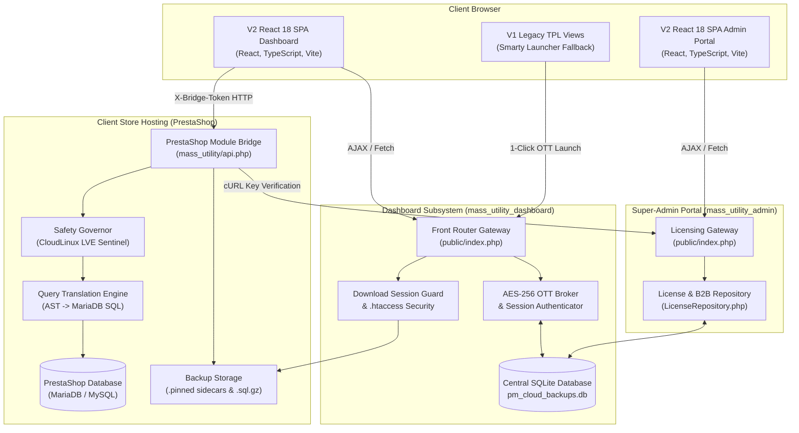
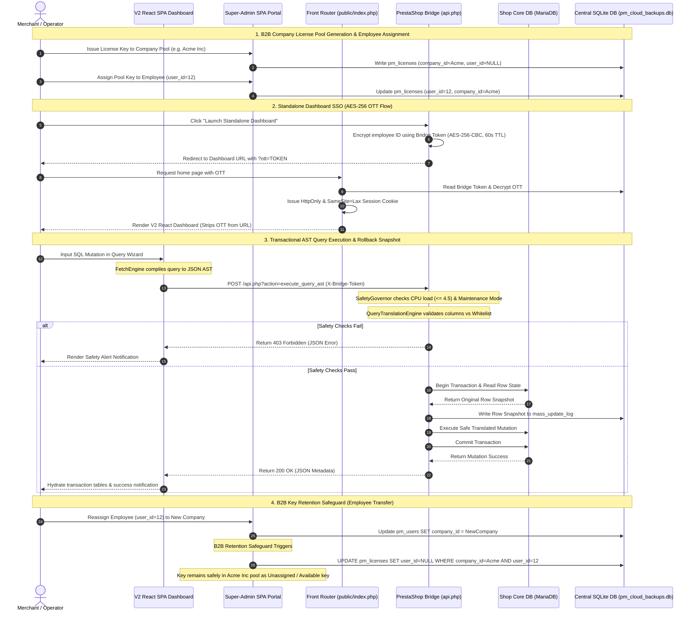
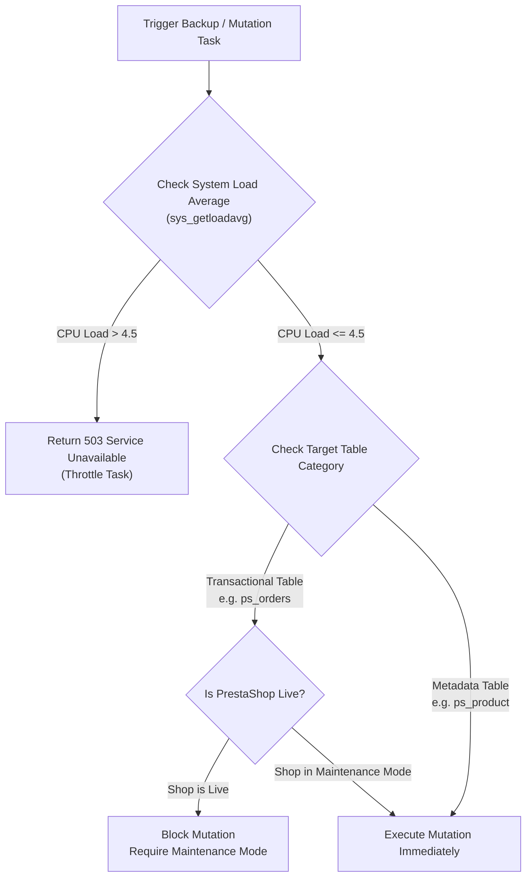

# 🗃️ Mass Utility - Consolidated Technical Manual & Reference Guide

Welcome to the **Mass Utility Framework**, an enterprise-grade, zero-trust decoupled administration suite and B2B SaaS licensing infrastructure designed for PrestaShop.

This framework separates your **Presentation / SaaS Dashboard UI (V2 React 18 SPA)** and **Super-Admin Licensing Portal (V2 React 18 SPA)** from your **PrestaShop Active Core** using a secure, transactional HTTP Bridge API. By segregating complex operations (such as AST database operations, chunked backups, search index sweeps, B2B license pool management, and local transaction log rollbacks) from the main database execution stream, Mass Utility preserves store speed and hosting limits while offering maximum operational security.

---

## 📊 1. Comprehensive System Architecture & Interconnectivity

Mass Utility is structured as a decoupled monorepo containing three primary subsystems:
1. **Native PrestaShop Module (`mass_utility/`)**: The transactional bridge executing operations on PrestaShop core tables (MariaDB) and enforcing CloudLinux LVE safety bounds.
2. **Standalone SaaS Dashboard (`mass_utility_dashboard/`)**: The modern V2 Single-Page Application (SPA) built with **React 18 + TypeScript + Vite** used by merchant operators to write AST queries, manage files, inspect diffs, and control backup repositories.
3. **Super-Admin Licensing & B2B Portal (`mass_utility_admin/`)**: The centralized licensing server and B2B directory used by system operators to manage company profiles, issue company license pools, reassign team members, and enforce domain bindings.

---

### 1.1 Decoupled Component & Layering Architecture



---

### 1.2 End-to-End Handshake & Execution Sequence



---

## 🎨 2. User Interface Architecture & Design System

The Mass Utility Framework enforces a unified **V2 React 18 SPA Architecture & Design System Policy**:

### 2.1 Single UI & PrestaShop Launcher Integration
- **V2 React 18 SPA Dashboard**: Primary merchant interface located in `mass_utility_dashboard/frontend/` and compiled directly to `mass_utility_dashboard/public/v2/`.
- **V2 React 18 SPA Super-Admin**: Primary licensing & tenant operations interface located in `mass_utility_admin/frontend/` and compiled directly to `mass_utility_admin/public/v2/`.
- **PrestaShop Back-Office Launcher Card**: Clean, native PrestaShop Smarty template (`mass_utility_dashboard/views/templates/admin/configure.tpl`) providing 1-click AES-256 OTT redirection from PrestaShop Back-Office directly to the V2 Standalone Dashboard.

### 2.2 Dashboard V2 React Component Architecture (`mass_utility_dashboard/frontend/src/components/`)
- `<QueryWizardTab>` (`🛒 Mass Updates`): Visual AST query builder with live SQL preview, domain preset loadout bar, and execution simulation mode.
- `<MutationHistoryTab>` (`🕒 Mutation History`): Historical execution ledger featuring the **MariaDB SQL Reconstruction Engine** (`sqlReconstructor.ts`), revert payload inspect modal, and 1-click rollback execution.
- `<MerchantSecurityTab>` (`🛡️ Security & Health`): Top-level merchant security inspector featuring 4 diagnostic cards (HTTP Headers, PrestaShop Core & SSL, Filesystem Permissions, Executive System Health) with 1-click repairs (**`[🔒 Apply .htaccess Headers]`**, **`[📁 Repair Permissions]`**, **`[⚡ Enforce Store SSL]`**).
- `<EventLogsTab>` (`📜 Event Logs`): Searchable audit trail for system operations and Bridge API communication logs.
- `<SettingsTab>` (`⚙️ Settings`): Dashboard configuration, license key details, and connection status settings.
- `<DatabaseToolsTab>`: Schema inspection, direct query runner, and Database Diff drift analysis modal.
- `<BackupsGrid>` & `<BackupSubTab>`: Time-resilient backup management featuring the **`.pinned` Sidecar Metadata Subsystem**.
- `<GovernorTab>`: Real-time CloudLinux LVE telemetry dashboard featuring **Zero-CLS Instant Skeleton Frame Architecture**.

### 2.3 Super-Admin V2 React Component Architecture (`mass_utility_admin/frontend/src/components/`)
- `<CompanyListView>` & `<CompanyDetailsView>`: **Companies Directory** featuring real-time license utilization meters (`usedCount` / `max_licenses`), Dual-Mode tab switcher (`[📊 Overview]` vs `[⚙️ Edit Profile & Settings]`), 1-click pool key generator, master `<PaginationBar>`, and employee assignment select dropdowns.
- `<ClientListView>` & `<ClientDetailsView>`: **Clients Directory** featuring Client Full Name (`name`) support, Company Dropdown client reassignment, Dual-Mode tab switcher (`[📊 Overview & Keys]` vs `[⚙️ Edit Client & Settings]`), password masking toggles (`<Eye />` / `<EyeOff />`), master `<PaginationBar>`, and Company Pool Ownership badges (`🏢 Owned by Acme Inc Pool`).
- `<LicensesTab>`: **License Registry & Subscriptions** featuring 9-column exact header alignment, `<ConfirmModal>` Suspend/Activate safety shield, 4-card telemetry grid, `Company Owner` column, `Assigned Employee` column, master `<PaginationBar>`, and 1-click key masking.
- `<AuditLogsTab>`: **Operations Audit Trail** featuring search & filter toolbar, **`[Clear Audit Logs]`** with red `<ConfirmModal>` confirmation safety prompt, master `<PaginationBar>`, and Light/Dark adaptive code terminal for raw JSON inspection.
- `<SettingsTab>`: Full-width 2-column side-by-side password form layout with icon inputs (`<FormInput type="password" icon={Lock} />`).
- `<PackageTiersTab>`: **Package Tiers & Quotas** feature capability matrix editor for `basic`, `pro`, `enterprise` subscription tiers.
- `<SecurityHealthTab>`: Super Admin 4-Card Security Grid auditing SaaS server infrastructure (HSTS, SSL 301 Redirect Enforcer, Vault Isolation `pm_cloud_backups.db` 403, SaaS Server Filesystem Permissions).

### 2.4 Normalized Interactive UX Features & Primitives
- **Master Data Table Pagination (`<PaginationBar>`)**: Standardized data table pagination with dynamic page size options (`10`, `25`, `50`, `100`), `< Previous` / `Next >` navigation, and real-time item counter across all listing tables.
- **Safety Confirmation Shield (`<ConfirmModal>`)**: Modal overlay shield for high-impact actions (Suspend, Activate, Delete Company/Client, Clear Audit Logs) featuring backdrop blur (`backdrop-blur-md z-[9999999]`), `top-0 left-0 w-screen h-screen` bounds, and variant-specific color schemes (`danger`, `warning`, `info`).
- **Enhanced Select Dropdowns (`<FormSelect>`)**: Standardized custom dropdown primitive featuring custom SVG chevron arrow icons, hover/focus rings (`focus:border-pm-primary focus:ring-1 focus:ring-pm-primary/30`), and option styling.
- **Normalized Bottom-Right Toast Engine**: Notifications across both portals are positioned at **Bottom-Right** (`fixed bottom-5 right-5 z-[999999]`), featuring dark backdrop blur (`backdrop-blur-md`), elevated drop shadows (`shadow-2xl`), left status accent borders (`border-l-4`), and an instant manual dismissal button (`<X />`).
- **Animated Refresh Feedback**: Toolbar Refresh buttons feature an active spinning animation (`<RefreshCw className="animate-spin text-purple-400" />`), disabled click states, and success toast responses across all directory tabs.
- **Interactive Password Visibility Toggles**: All password input fields feature interactive `<Eye />` / `<EyeOff />` toggles.

### 2.5 Design System & System Tokens (`index.css`)
All V2 React components inherit from unified CSS design tokens (`var(--pm-*)`):
- **Theme Variables**: `--pm-bg`, `--pm-card-bg`, `--pm-input-bg`, `--pm-border-color`, `--pm-primary`, `--pm-success`, `--pm-danger`.
- **Dark & Light Mode Adaptation**: Root level `color-scheme: dark` and `color-scheme: light` coupled with custom WebKit scrollbars (`::-webkit-scrollbar`).
- **3-Tier Action Button Hierarchy**:
  - **Tier 1 (Primary Action)**: `.pm-btn-primary` (Solid accent color for main actions like `🔄 Revert` or `☁️ Push to Cloud`).
  - **Tier 2 (Secondary Actions)**: `.pm-btn-neutral` (Subtle theme pills for non-destructive actions like `👁️ View`, `📥 Download`, `📌 Pin`).
  - **Tier 3 (Destructive Actions)**: `.pm-btn-danger-outline` (Subtle red outline/tint on hover for `🗑️ Delete`).

---

## 📁 3. Monorepo Repository Structure

```
d:/Project Mass/
├── WORKSPACE.md                    # Workspace constitution and directory manifest
├── README.md                       # Master consolidated technical manual
├── .gitignore                      # Workspace ignore rules (DBs, logs, build outputs)
├── .bench/                         # Benchmarking, audits, and automated doc maps
│   ├── docs/                       # Architectural dictionaries & design system maps
│   └── scripts/                    # JIT verification tools and build scripts
├── .orchestra/                     # Conductor pipeline tools and pre-commit hooks
│   └── .conductor/tools/           # cli_commit.py, workspace_inspector.py, cli_security_audit.py
├── mass_utility/                   # NATIVE PRESTASHOP MODULE (Transactional Bridge)
│   ├── mass_utility.php            # Module installer, hooks, back-office controller
│   ├── api.php                     # Unauthenticated gateway receiver for Dashboard API calls
│   ├── backups/                    # Storage directory protected by .htaccess (Require all denied)
│   ├── src/
│   │   ├── Compiler/
│   │   │   └── QueryTranslationEngine.php  # AST compiler, query whitelist, rollback compiler
│   │   ├── Controller/Api/
│   │   │   ├── DatabaseApiController.php   # Database backups, SQL dumps & pin actions
│   │   │   └── FileToolsApiController.php  # File backups, Google Drive sync & pin actions
│   │   └── Governor/
│   │       └── SafetyGovernor.php          # Monitors CloudLinux LVE limits & shop maintenance mode
│   │
│   mass_utility_dashboard/         # MERCHANTS CLIENT PORTAL (Standalone Dashboard)
│   ├── backups/                    # Dashboard local backup storage protected by .htaccess
│   ├── data/                       # Central SQLite database (pm_cloud_backups.db)
│   ├── frontend/                   # V2 REACT 18 + TYPESCRIPT + VITE SPA SOURCE
│   │   ├── src/
│   │   │   ├── components/         # React Tab Orchestrators & Feature Panels
│   │   │   │   └── common/         # Atomic UI Primitives (SectionHeader, BaseModal, DataTable, LogTerminal, PresetLoadoutBar, StatusBadge, ProgressHUD, DirectoryToolbar, DirectoryCardTable)
│   │   │   ├── utils/              # sqlReconstructor.ts, FetchService.ts
│   │   │   └── index.css           # Design tokens, cross-browser scrollbars (.pm-scrollbar), & 3-Tier Shadow Elevation UX System
│   │   ├── package.json            # Vite build scripts
│   │   └── vite.config.ts          # Vite build configuration (outputs to public/v2/)
│   ├── public/
│   │   ├── index.php               # Front Router, OTT decryptor, Session Guard & Download Interceptor
│   │   └── v2/                     # Compiled V2 React SPA static assets (index.html, JS, CSS)
│   └── src/
│       ├── Controller/Api/         # Dashboard API endpoints
│       └── Service/
│           ├── SQLiteConnectionManager.php # SQLite PDO manager
│           └── TenantSettingsRepository.php# Settings repository with KV cache
│
└── mass_utility_admin/             # SUPER-ADMIN LICENSING & B2B PORTAL
    ├── public/
    │   ├── index.php               # Licensing gateway, activate_key endpoint & admin router
    │   └── v2/                     # Compiled V2 Super-Admin React SPA static assets (index.html, JS, CSS)
    ├── src/
    │   ├── Controller/
    │   │   └── AdminApiController.php # Admin AJAX actions (key generation, company CRUD, user CRUD, assign license)
    │   ├── Repository/
    │   │   └── LicenseRepository.php  # License, company, and user CRUD with B2B retention safeguard
    │   └── Service/
    │       └── AdminSettingsManager.php # PDO manager & self-healing SQLite schema auto-migrations
    └── frontend/                   # V2 REACT 18 + TYPESCRIPT + VITE SPA SOURCE
        └── src/
            └── components/         # CompanyListView, CompanyDetailsView, ClientListView, ClientDetailsView, LicensesTab, PackageTiersTab, SecurityHealthTab
```

---

## 🔒 4. Security, Zero-Trust & Audit Architecture

### 4.1 Headless Bridge Authentication
All requests hitting the PrestaShop Module Bridge (`mass_utility/api.php`) must carry:
- `X-Bridge-Token`: Matches the locally stored PrestaShop configuration value (`PM_SECURE_TOKEN`).
- `X-Bridge-Version`: Must assert exact compatibility with schema version `1.0.0`.

### 4.2 One-Time Token (SSO / OTT) AES-256 Redirect Flow
When the merchant administrator clicks **Launch Standalone Dashboard** in PrestaShop Back Office:
1. **Encryption**: The module encrypts the employee ID, bridge token, and an expiry timestamp (60s TTL) using `AES-256-CBC`.
2. **Redirect**: Redirects to `https://dashboard-url.com/?ott=<encrypted_token>`.
3. **Decryption**: The dashboard backend reads the bridge token from SQLite, decrypts the payload, verifies timestamp validity, and sets a hardened session.
4. **URL Scrubbing**: The OTT parameter is stripped immediately from the browser URL bar, neutralizing replay attacks.

### 4.3 Authenticated Download Session Guard ([public/index.php](file:///d:/Project%20Mass/mass_utility_dashboard/public/index.php#L150-L160))
Top-level direct file download interceptors (`download_backup`, `download_file_backup`, `download_file_backup_log`, `download_from_drive`) require an active authenticated session (`!empty($_SESSION['employee_id'])`). Unauthenticated requests are rejected with HTTP 403 Forbidden.

### 4.4 Direct Access Web Restriction (`.htaccess`)
Direct web access to backup storage directories (`mass_utility/backups/` and `mass_utility_dashboard/backups/`) is blocked via `.htaccess`:
```apache
<IfModule mod_authz_core.c>
    Require all denied
</IfModule>
<IfModule !mod_authz_core.c>
    Deny from all
</IfModule>
```
*Note: PHP scripts on the server use internal filesystem access (`readfile()`), bypassing HTTP `.htaccess` blocks to stream downloads securely to authenticated users.*

### 4.5 SaaS Server 4-Card Security Inspector & 1-Click Repairs
The Super Admin Portal includes a 4-Card Infrastructure Security Inspector (`SecurityHealthTab.tsx`):
- **Card 1: HTTP Security Headers**: Checks HSTS, `X-Content-Type-Options: nosniff`, `X-Frame-Options: SAMEORIGIN`, `Referrer-Policy`. Includes 1-click repair (`[🔒 Apply Security Headers]`).
- **Card 2: SSL 301 HTTPS Enforcer**: Checks whether HTTP requests automatically redirect to HTTPS. Includes 1-click repair (`[⚡ Enforce SSL Redirect]`).
- **Card 3: Vault Storage Isolation**: Verifies `pm_cloud_backups.db` returns 403 Forbidden via HTTP.
- **Card 4: SaaS Filesystem Permissions**: Audits directory (`0755`) and file (`0644`) permissions. Includes 1-click repair (`[📁 Repair Permissions]`).

### 4.6 Automated Security Audit Pipeline (`cli_security_audit.py`)
Integrated into the pre-commit build pipeline, `cli_security_audit.py` scans JavaScript files for unsafe DOM injections (`innerHTML`), verifies `escapeshellarg()` on PHP shell executions, and audits SQLite queries for prepared statement compliance.

---

## 🛠️ 5. MariaDB AST Query & SQL Reconstruction Engine

### 5.1 Abstract Syntax Tree (AST) Payload Structure
Instead of accepting raw SQL strings from the frontend, the Query Wizard generates a structured JSON AST payload:
```json
{
  "target_table": "ps_product_shop",
  "mutation_type": "UPDATE",
  "update_fields": {
    "price": "price * 1.10",
    "active": 1
  },
  "where_conditions": [
    { "field": "id_category_default", "operator": "=", "value": 5 }
  ]
}
```

### 5.2 SQL Reconstruction & Rollback Projection (`sqlReconstructor.ts`)
The V2 React SPA includes a client-side MariaDB SQL reconstruction utility (`src/utils/sqlReconstructor.ts`):
- **Executable Query Reconstruction**: Reconstructs valid, syntax-highlighted MariaDB `UPDATE` statements from JSON AST payloads.
- **Rollback SQL Projection**: Parses `revert_payload` row snapshots captured during execution and projects the exact SQL statements required to undo the transaction.
- **1-Click Copy Buttons**: Provides 1-click clipboard copy buttons with interactive toast notifications for both JSON payloads and SQL code snippets inside the Mutation History Inspect Modal.

---

## 📌 6. Time-Resilient Backup Engine & Pinning Subsystem

### 6.1 Chunked Backup Dumping
To prevent PHP timeouts (`max_execution_time`) on large store databases:
- **Paginated Read**: Reads tables in 5,000-row chunks.
- **Gzip Streaming**: Compresses output directly into `.sql.gz` streams.
- **Google Drive Multipart Upload**: Splits large uploads into 5MB chunks with sequential retry capabilities.

### 6.2 Backup Pinning Subsystem (`📌 Pin` / `📌 Unpin`)
Merchants can pin critical historical backups to prevent accidental deletion and keep them at the top of the repository grid:
- **Sidecar Metadata Files**: Pin toggles write or delete `.pinned` sidecar files (e.g. `backup_2026-07-22.sql.gz.pinned`).
- **Repository Sorting**: Server API lists read `.pinned` sidecars and sort pinned backups above unpinned entries.
- **API Controllers**: Managed via `toggle_pin_file_backup` in `FileToolsApiController.php` and `toggle_pin_backup` in `DatabaseApiController.php`.

---

## ⚡ 7. Native Safety Governor & CloudLinux LVE Telemetry



### 7.1 Real-Time CPU Load Monitoring
Evaluates server 1-minute load average before executing heavy queries. If CPU load exceeds `4.5`, the Safety Governor throttles execution to protect store performance.

### 7.2 Zero-CLS Instant Skeleton Frame Architecture
To eliminate Cumulative Layout Shift (CLS) on page refresh in `GovernorTab.tsx`:
- The Hero Card shell ("Native Safety Governor", "CloudLinux LVE" badge) renders **instantly on frame 0**.
- Dynamic telemetry values display smooth `animate-pulse bg-pm-input/50` skeleton shimmers while loading.
- Badge statuses transition smoothly to `SAFE TO OPERATE` with **zero height shifts or layout jumps (CLS = 0)**.

---

## 🗄️ 8. Centralized SQLite Database Schema Reference

All dashboard configurations, licensing data, B2B companies, query presets, and rollback snapshots are stored in `mass_utility_dashboard/data/pm_cloud_backups.db`:

```sql
-- 1. Tenant Settings Configuration
CREATE TABLE tenant_settings (
    name VARCHAR(255) PRIMARY KEY,
    value TEXT
);

-- 2. Query Wizard Presets
CREATE TABLE mass_update_presets (
    id_preset INTEGER PRIMARY KEY AUTOINCREMENT,
    name VARCHAR(255) NOT NULL,
    type VARCHAR(50) NOT NULL,
    payload TEXT NOT NULL,
    date_add DATETIME NOT NULL
);

-- 3. Mutation Execution History & Rollback Snapshots
CREATE TABLE mass_update_log (
    id_mass_update_log INTEGER PRIMARY KEY AUTOINCREMENT,
    job_id VARCHAR(64) NOT NULL,
    state VARCHAR(24) NOT NULL,
    affected_count INT DEFAULT 0,
    payload TEXT NOT NULL,
    revert_payload TEXT DEFAULT NULL,
    errors TEXT DEFAULT NULL,
    date_add DATETIME NOT NULL,
    date_upd DATETIME NOT NULL,
    UNIQUE (job_id)
);

-- 4. B2B Companies Directory
CREATE TABLE pm_companies (
    id INTEGER PRIMARY KEY AUTOINCREMENT,
    company_name VARCHAR(255) UNIQUE NOT NULL,
    tax_id VARCHAR(100) NULL,
    max_licenses INTEGER DEFAULT 10,
    status VARCHAR(32) DEFAULT 'active',
    created_at DATETIME DEFAULT CURRENT_TIMESTAMP,
    updated_at DATETIME DEFAULT CURRENT_TIMESTAMP
);

-- 5. Merchant Users / Client Accounts Registry
CREATE TABLE pm_users (
    id INTEGER PRIMARY KEY AUTOINCREMENT,
    name VARCHAR(255) NULL,
    email VARCHAR(255) UNIQUE NOT NULL,
    password_hash VARCHAR(255) NOT NULL,
    company_name VARCHAR(255) NULL,
    company_id INTEGER NULL,
    role VARCHAR(50) DEFAULT 'owner',
    status VARCHAR(32) DEFAULT 'active',
    created_at DATETIME DEFAULT CURRENT_TIMESTAMP,
    updated_at DATETIME DEFAULT CURRENT_TIMESTAMP,
    FOREIGN KEY(company_id) REFERENCES pm_companies(id) ON DELETE SET NULL
);

-- 6. License Keys & Company Pool Registry
CREATE TABLE pm_licenses (
    id INTEGER PRIMARY KEY AUTOINCREMENT,
    company_id INTEGER NULL,
    user_id INTEGER NULL,
    license_key VARCHAR(64) UNIQUE NOT NULL,
    store_url VARCHAR(255) NULL,
    package_tier VARCHAR(32) DEFAULT 'basic',
    status VARCHAR(32) DEFAULT 'active',
    expires_at DATETIME NULL,
    created_at DATETIME DEFAULT CURRENT_TIMESTAMP,
    updated_at DATETIME DEFAULT CURRENT_TIMESTAMP,
    FOREIGN KEY(company_id) REFERENCES pm_companies(id) ON DELETE CASCADE,
    FOREIGN KEY(user_id) REFERENCES pm_users(id) ON DELETE SET NULL
);

-- 7. Super-Admin Credentials
CREATE TABLE pm_admins (
    id INTEGER PRIMARY KEY AUTOINCREMENT,
    username VARCHAR(128) UNIQUE NOT NULL,
    password_hash VARCHAR(255) NOT NULL,
    created_at DATETIME DEFAULT CURRENT_TIMESTAMP
);
```

---

## 🔌 9. Complete API Endpoint Reference Matrix

### 9.1 Standalone SaaS Dashboard & Bridge Relay Routes (`public/index.php`)

| Action Key | HTTP Method | Auth Required | Description |
| :--- | :--- | :--- | :--- |
| `get_auth_status` | `POST` | Yes | Asserts session authentication and checks Google Drive OAuth status. |
| `get_diagnostics` | `POST` / `GET` | Yes | Relays security diagnostics request to merchant PrestaShop host (`SystemApiController`). |
| `apply_security_headers` | `POST` | Yes | Relays `.htaccess` security headers injection request to remote merchant host. |
| `fix_diagnostics_permissions` | `POST` | Yes | Relays filesystem permissions repair (`0755`/`0644`) to remote merchant host. |
| `enable_ssl` | `POST` | Yes | Relays 1-click store SSL enforcement (`PS_SSL_ENABLED = 1`) to remote merchant host. |
| `download_backup` | `GET` | Yes (Session) | Intercepts direct database backup Gzip file downloads. |
| `download_file_backup` | `GET` | Yes (Session) | Intercepts direct filesystem backup archive downloads. |
| `download_file_backup_log` | `GET` | Yes (Session) | Intercepts direct file backup log file downloads. |
| `toggle_pin_backup` | `POST` | Yes | Toggles `.pinned` sidecar file for database backups. |
| `toggle_pin_file_backup` | `POST` | Yes | Toggles `.pinned` sidecar file for filesystem backups. |

### 9.2 Headless Bridge API Routes (`mass_utility/api.php`)

| Action Key | HTTP Method | Header Token | Description |
| :--- | :--- | :--- | :--- |
| `ping` | `GET` | Required | System diagnostics ping returning CPU load, memory, and probe status. |
| `get_diagnostics` | `GET` | Required | Audits HTTP headers, `.git` config, debug mode, SSL, and filesystem perms on merchant host. |
| `apply_security_headers` | `POST` | Required | Injects HSTS, `nosniff`, `SAMEORIGIN`, and `Referrer-Policy` headers into store `.htaccess`. |
| `fix_permissions` | `POST` | Required | Auto-repairs store root, `config/`, `modules/`, `override/`, `var/logs/` perms to `0755`/`0644`. |
| `enable_ssl` | `POST` | Required | Sets `PS_SSL_ENABLED = 1` and `PS_SSL_ENABLED_EVERYWHERE = 1` in PrestaShop configuration. |
| `get_catalog_stats` | `GET` | Required | Returns product, category, and order counts. |
| `query_products` | `POST` | Required | Translates JSON AST criteria and returns matching product IDs. |
| `db_query` | `POST` | Required | Safe execution gateway for schema inspection queries. |
| `execute_query_ast` | `POST` | Required | Executes transactional AST query and records rollback snapshot. |
| `revert_mutation` | `POST` | Required | Executes counter-query to restore original row states from snapshot. |

### 9.3 Super Admin Licensing Portal API Routes (`mass_utility_admin/public/index.php`)

| Action Key | HTTP Method | Auth Required | Description |
| :--- | :--- | :--- | :--- |
| `api_status` | `GET` | No | Returns admin account setup status and authentication state. |
| `api_login` | `POST` | No | Authenticates Super Admin credentials against `pm_admins` table. |
| `api_list` | `GET` | Yes | Returns all clients, active licenses, package tiers, and system diagnostics. |
| `api_create_company` | `POST` | Yes | Creates new B2B company profile with license capacity limits and optional owner account. |
| `api_update_company` | `POST` | Yes | Updates company profile settings, VAT ID, and license cap limits. |
| `api_delete_company` | `POST` | Yes | Permanently deletes company profile and unlinks team members. |
| `api_create_user` | `POST` | Yes | Creates new client account with BCRYPT password hashing and company linking. |
| `api_update_user` | `POST` | Yes | Updates client full name, email, company association, role, and status. Triggers B2B Key Retention Safeguard. |
| `api_delete_user` | `POST` | Yes | Safely unbinds client licenses and deletes client account. |
| `api_reset_user_password` | `POST` | Yes | Resets client account password with BCRYPT hashing. |
| `api_generate` | `POST` | Yes | Issues new license key directly to a Company Pool (`company_id`) or standalone client. |
| `api_assign_license` | `POST` | Yes | Assigns or unassigns a company pool license key to/from a team member (`user_id`). |
| `api_get_diagnostics` | `GET` | Yes | Runs 4-Card SaaS Server Infrastructure Security Audit. |
| `api_apply_security_headers` | `POST` | Yes | Injects HSTS, `nosniff`, and `SAMEORIGIN` headers into SaaS server root `.htaccess`. |
| `api_enable_ssl_redirect` | `POST` | Yes | Injects 301 HTTPS Rewrite Rule into SaaS server root `.htaccess`. |
| `api_fix_permissions` | `POST` | Yes | Repairs SaaS server directory (`0755`) and file (`0644`) permissions. |

---

## 🛠️ 10. Setup, Build Pipeline & Orchestra Developer Tools

### 10.1 Initializing the Database Registry
Run the SQLite migration script from the root workspace:
```bash
php mass_utility_dashboard/bin/migration.php
```

### 10.2 Building the V2 React SPA Dashboard & Super-Admin
Build production static assets for the Standalone Dashboard:
```bash
cd mass_utility_dashboard/frontend
npm run build
```
*Outputs compiled assets (`index-*.js`, `index-*.css`) to `mass_utility_dashboard/public/v2/`.*

Build production static assets for the Super-Admin Licensing Portal:
```bash
cd mass_utility_admin/frontend
npm run build
```
*Outputs compiled assets (`index-*.js`, `index-*.css`) to `mass_utility_admin/public/v2/`.*

### 10.3 Orchestra Pre-Commit Pipeline & Tools
The workspace includes automated Orchestra developer tools in `.orchestra/.conductor/tools/`:
- `python .orchestra/.conductor/tools/workspace_inspector.py plan "<GOAL>"`: Pre-flight impact analysis, symbol mapping, and pre-flight plan synthesis.
- `python .bench/scripts/generate_frontend_map.py`: Universal stack-conditioned frontend AST mapper (React TSX/JSX, Vanilla JS, CSS tokens, Smarty/HTML).
- `python .orchestra/.conductor/tools/cli_doctor.py`: Environment health audit & SHA-256 cryptographic integrity lockfile (`.orchestra/orchestra.lock`) generator.
- `python .orchestra/.conductor/tools/cli_security_audit.py`: Scans JS/PHP files for security vulnerabilities and high-entropy secrets.
- `python .orchestra/.conductor/tools/cli_commit.py`: Atomically ingests `.ai_plan.md` into conventional git commits, runs all 11 build pipeline hooks in parallel (with Smart Conditional Vite Auto-Build when `frontend/src/` is modified), and stages changes.

---

## 🔧 11. Troubleshooting & Emergency Protocols

### 11.1 Reclaiming Access After a Safety Lockout
If server CPU load is high or the shop state is misidentified, you can temporarily bypass the Safety Governor:
1. Log into your server via SSH.
2. Navigate to `mass_utility/`.
3. Create an empty bypass file:
   ```bash
   touch .bypass_governor
   ```
4. Safety Governor checks are bypassed for 15 minutes before the sentinel auto-removes the file.

### 11.2 Re-Syndicating Framework Rules
If directories or tools are moved, re-run the framework syndication installer:
```bash
python .orchestra/.conductor/tools/install_framework.py
```
